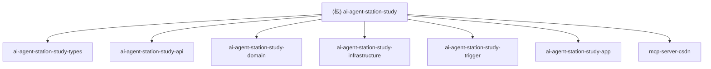

# AI Agent Station Study

AI Agent 智能体工作站 - 基于 DDD 分层架构的智能对话系统

---

## 项目愿景

构建一个支持多策略（AutoAgent、FlowAgent、ReAct）的智能 Agent 调度平台，提供对话管理、任务编排、工具调用（MCP）和知识库 RAG 能力。

---

## 架构总览

技术栈：Spring Boot 3.4.3 + Java 17 + Spring AI 1.1.4 + MyBatis-Plus + MySQL + pgvector

架构模式：DDD 分层架构（参考小傅哥扳手工程）

---

## 模块结构图



---

## 模块索引

| 模块路径 | 职责 | 技术特点 |
|---------|------|---------|
| [ai-agent-station-study-types](./ai-agent-station-study-types/CLAUDE.md) | 基础类型、常量、异常、任务调度接口 | 无外部依赖，被所有模块引用 |
| [ai-agent-station-study-api](./ai-agent-station-study-api/CLAUDE.md) | DTO 定义、服务接口契约 | 面向前端的请求/响应对象 |
| [ai-agent-station-study-domain](./ai-agent-station-study-domain/CLAUDE.md) | 核心业务逻辑、领域模型、Agent 执行引擎 | Spring AI、策略模式、责任链模式 |
| [ai-agent-station-study-infrastructure](./ai-agent-station-study-infrastructure/CLAUDE.md) | 数据访问、仓储实现、外部网关 | MyBatis-Plus、DAO、PO |
| [ai-agent-station-study-trigger](./ai-agent-station-study-trigger/CLAUDE.md) | HTTP 接口、定时任务、消息监听 | Controller、Job、VO |
| [ai-agent-station-study-app](./ai-agent-station-study-app/CLAUDE.md) | 应用启动、配置、全局装配 | Spring Boot 启动类、配置文件 |
| [mcp-server-csdn](./mcp-server-csdn/CLAUDE.md) | CSDN MCP 服务器 | 独立 Spring Boot 应用，提供 CSDN 文章工具 |

---

## 运行与开发

### 环境要求
- JDK 17+
- Maven 3.8+
- MySQL 8.0
- PostgreSQL 15+ (pgvector 扩展)

### 数据库配置
编辑 `ai-agent-station-study-app/src/main/resources/application-dev.yml`：
```yaml
spring:
  datasource:
    mysql:
      url: jdbc:mysql://127.0.0.1:3306/ai-agent-station
      username: root
      password: 123456
    pgvector:
      url: jdbc:postgresql://127.0.0.1:15432/ai-rag-knowledge
      username: postgres
      password: postgres
```

### 启动应用
```bash
cd ai-agent-station-study-app
mvn spring-boot:run
```

### 启动 MCP Server (CSDN)
```bash
cd mcp-server-csdn/mcp-server-csdn
mvn spring-boot:run
```

---

## 核心功能

### 1. Agent 类型
- **CHAT (0)**: 普通对话模式
- **PLAN_SOLVE (1)**: 深度思考模式（任务规划+执行）
- **REACT (2)**: 深度研究模式（多轮推理+工具调用）

### 2. 执行策略
- **AutoAgent**: 自动智能体，支持 Planner + Executor + Summary 多阶段
- **FlowAgent**: 流程智能体，基于 YAML 配置的执行流程
- **ReAct**: 推理-行动循环，支持工具调用

### 3. 工具生态
- 搜索工具 (deep_search)
- 代码解释器 (code_interpreter)
- 文件工具 (file_tool)
- 报告生成 (report_tool)
- MCP 工具 (通过 MCP Client 调用外部服务)

### 4. 数据持久化
- 会话管理: `ai_agent_conversation`
- 消息历史: `ai_agent_message`
- 消息事件: `ai_agent_message_event`
- 模型配置: `chat_model_info`, `chat_model_schema`

---

## 测试策略

### 单元测试位置
- `ai-agent-station-study-app/src/test/java/org/wwz/ai/test/`

### 测试类
- `AiAgentTest`: Agent 功能测试
- `FlowAgentTest`: 流程 Agent 测试
- `AutoAgentTest`: 自动 Agent 测试
- `*DaoTest`: DAO 层测试

### 运行测试
```bash
mvn test -pl ai-agent-station-study-app
```

---

## 编码规范

1. **包命名**: `org.wwz.ai.{模块}.{功能}`
2. **DDD 分层**:
   - `domain`: 实体、值对象、领域服务、仓储接口
   - `infrastructure`: 仓储实现、DAO、外部网关
   - `trigger`: 控制器、定时任务
   - `api`: DTO、服务接口
3. **配置管理**: 环境配置放在 `application-{profile}.yml`
4. **数据库**: 使用 MyBatis-Plus，Mapper XML 位于 `resources/mybatis/mapper/`

---

## AI 使用指引

### 添加新 Agent 类型
1. 在 `domain/agent/model/valobj/enums/` 定义枚举
2. 在 `domain/agent/service/` 实现执行逻辑
3. 在 `domain/agent/service/execute/` 添加策略工厂

### 添加新工具
1. 定义工具参数 DTO
2. 实现工具调用服务
3. 注册到 `ToolCallbackProvider`

### 修改数据库
1. 编辑 `ai-agent-station-study-app/src/main/resources/db/schema.sql`
2. 添加 MyBatis-Plus 实体类
3. 创建 DAO 接口

---

## 变更记录 (Changelog)

### 2026-04-07
- 初始化项目 AI 上下文文档
- 扫描项目结构，识别 7 个模块
- 生成根级 CLAUDE.md 和各模块 CLAUDE.md

---

## 覆盖率报告

| 模块 | 文件数 | 已扫描 | 覆盖率 |
|-----|-------|-------|-------|
| ai-agent-station-study-types | 12 | 12 | 100% |
| ai-agent-station-study-api | 45 | 45 | 100% |
| ai-agent-station-study-domain | 85+ | 60+ | ~70% |
| ai-agent-station-study-infrastructure | 35+ | 30+ | ~85% |
| ai-agent-station-study-trigger | 25+ | 20+ | ~80% |
| ai-agent-station-study-app | 40+ | 35+ | ~85% |
| mcp-server-csdn | 12 | 12 | 100% |

### 主要缺口
- Domain 模块部分 reactor 包下的实现类未完全扫描
- Infrastructure 模块的 gateway 实现未完全扫描
- 部分测试类未详细分析

### 推荐下一步
1. 补充扫描 `domain/agent/reactor/` 下的核心实现类
2. 补充扫描 `infrastructure/gateway/` 下的外部服务调用
3. 分析 `domain/agent/service/execute/` 下的执行策略实现
