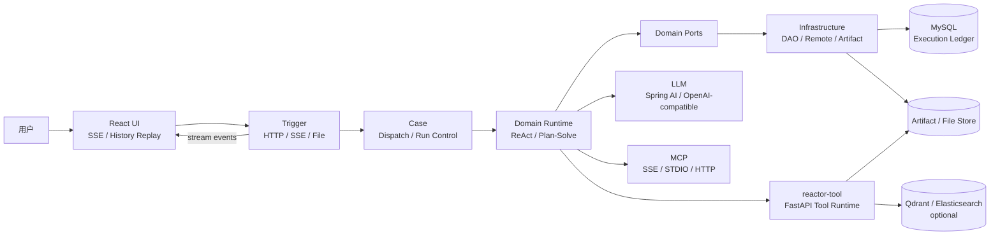

<p align="center">
  
</p>

<h1 align="center">Reactor</h1>

<p align="center">
  <strong>面向复杂任务的开源 Agent Runtime</strong>
</p>

<p align="center">
  让 Agent 从“会对话”走向“能执行”：规划、工具、记忆、产物与可回放历史，组成一条可观察、可扩展的任务链路。
</p>

<p align="center">
  An open-source runtime for building, running, and replaying tool-using agents.
</p>

<p align="center">
  
  
  
  
  
  
</p>

<p align="center">
  <a href="#快速开始">快速开始</a> ·
  <a href="#能力地图">能力地图</a> ·
  <a href="#系统架构">系统架构</a> ·
  <a href="#开发者入口">开发者入口</a> ·
  <a href="https://github.com/OWWZO/ai-agent">GitHub</a>
</p>

<p align="center">
  
</p>

> **项目状态**：Reactor 仍在持续演进。基础 Agent 执行链路可以独立运行；搜索、向量检索、图像生成、代码沙箱等能力需要根据部署环境配置对应的模型或外部服务。

## 定位

Reactor 是一个面向复杂任务自动化的开源 Agent 应用底座，由 Java Agent Runtime、React 工作台和 Python Tool Runtime 组成。

它把一次请求视为一条完整的执行记录，而不是一段临时对话：

```text
用户目标
  -> 策略选择
  -> 任务规划与工具调用
  -> 流式事件与中间产物
  -> 执行事实持久化
  -> 最终交付与历史回放
```

Reactor 适合用来构建深度研究、数据分析、知识库问答、内容生产和内部自动化等需要多步执行的 AI 应用。

## 为什么是 Reactor

| 关注点 | Reactor 的做法 | 带来的结果 |
| --- | --- | --- |
| 执行稳定性 | `ReAct` 与 `Plan-Solve` 两种执行策略，支持动态工具循环与计划推进 | 复杂任务不依赖单次 Prompt 临场发挥 |
| 工具扩展 | 内置工具、MCP、Skill 和远程 `reactor-tool` 统一接入 | 工具能力可以独立演进，不必把所有逻辑塞进主服务 |
| 上下文连续性 | 会话工作记忆、上下文压缩、SOP 召回与可选长期记忆 | 跨轮对话可以保留任务上下文与经验 |
| 结果可交付 | 会话级工作区、文件产物登记、HTML/图片/表格等结果展示 | 工具输出可以被后续步骤继续消费 |
| 可观察性 | LLM、Tool、Artifact、Run 全部进入 Execution Ledger | 任务过程可追踪、可审计、可回放 |
| 人机协作 | 计划审批、用户追问、停止、指导注入与断线续观测 | 人可以在关键节点接管执行 |

## 能力地图

### Agent Runtime

- **ReAct**：围绕目标持续执行“思考 → 调用工具 → 观察结果”的循环。
- **Plan-Solve**：先拆解计划，再按步骤调度执行 Agent，最后由总结阶段收口。
- **并发工具执行**：同一轮多个工具调用可以统一调度，并集中处理事件、产物与账本记录。
- **模型运行时目录**：从 MySQL 模型配置中选择模型，支持本轮模型与思考档位覆盖。

### Tool Fabric

- **内置工具**：`deepsearch`、`web_fetch`、`code_interpreter`、`report`、`image_generation`、数据分析、文档处理等。
- **MCP**：支持 SSE、STDIO 与 Streamable HTTP 传输方式。
- **远程工具运行时**：`reactor-tool` 基于 FastAPI 提供搜索、代码、文件、报告、MRAG 和数据处理能力。
- **Skill Runtime**：从 `runtime/skills/` 加载可复用的领域指令、脚本和工作流知识。

### Memory & Context

- 会话级工作记忆与跨轮消息 hydrate。
- 上下文压缩，控制长任务中的 Token 使用量。
- SOP 语义召回，让相似任务的执行经验可以参与新任务规划。
- 可选的用户级 curated memory 与长期记忆 Provider。

### Execution & Delivery

- 每个请求拥有独立的 `session`、`run` 和 `requestId`。
- 工具调用、结构化工具输出、文件和图片统一登记为 Artifact。
- SSE 实时输出 Agent 文本、计划、工具状态、文件和任务进度。
- 历史会话直接从执行账本投影，支持断线后继续观察和稳定回放。

## 典型任务

| 场景 | 执行链路 | 主要能力 |
| --- | --- | --- |
| 深度研究 | 问题拆解 → 多轮搜索 → 证据整理 → 报告交付 | Plan-Solve、DeepSearch、Report、SOP |
| 数据分析 | 读取数据 → 清洗与计算 → 趋势分析 → 图表或报告 | Code Interpreter、Data Analysis、Chart |
| 知识库问答 | 文档解析 → 多路召回 → 重排序 → 带上下文回答 | MRAG、Qdrant、Elasticsearch、Rerank |
| 内容生产 | 主题研究 → 结构生成 → 文档/PPT/网页交付 | Search、Document、Slides、Skill |
| 工程辅助 | 读取文件 → 运行脚本 → 汇总结果 → 产物预览 | Workspace、Sandbox、MCP、Artifact |

## 运行展示

<p align="center">
  
  
</p>

<p align="center">
  
  
</p>

<p align="center">
  
  
</p>

## 快速开始

### 环境要求

- JDK 21
- Maven 3.8+
- Node.js 18+ 与 pnpm
- Python 3.11+ 与 uv
- MySQL 8
- 一个 OpenAI-compatible LLM API
- Qdrant、Elasticsearch、图像模型、搜索服务和 E2B 沙箱均为可选能力

### 1. 获取代码

```bash
git clone https://github.com/OWWZO/ai-agent.git
cd ai-agent
```

### 2. 初始化数据库

创建与开发配置一致的数据库，并导入以下脚本。也可以使用自定义数据库名，但需要同步修改 `application-dev.yml` 中的连接地址。

```bash
mysql -u root -p -e "CREATE DATABASE IF NOT EXISTS \`ai-agent-station\` CHARACTER SET utf8mb4 COLLATE utf8mb4_unicode_ci"
mysql -u root -p ai-agent-station < Reactor-agent-app/src/main/resources/db/schema.sql
mysql -u root -p ai-agent-station < Reactor-agent-app/src/main/resources/db/data.sql
```

运行时模型目录至少需要一条启用的 `ai_client_api` 与 `ai_client_model` 配置，填写 OpenAI-compatible API 的 `base_url`、`api_key` 和 `model_name`。问数示例数据由 `data.sql` 提供。

### 3. 启动 Python Tool Runtime

`reactor-tool` 默认监听 `1601` 端口，负责远程工具、文件服务和部分 RAG 能力。

```bash
cd reactor-tool
uv sync
cp .env_template .env
# 编辑 .env，至少配置 OPENAI_API_KEY 与 OPENAI_BASE_URL
./start.sh
```

Windows PowerShell：

```powershell
cd reactor-tool
uv sync
Copy-Item .env_template .env
# 编辑 .env 后执行
.\start.ps1
```

### 4. 启动 Java Backend

在新的终端回到仓库根目录：

```bash
mvn -pl Reactor-agent-app -am package '-Dmaven.test.skip=true'
java -jar Reactor-agent-app/target/Reactor-agent-app.jar
```

Backend 默认监听 `http://127.0.0.1:8100`。健康检查：

```bash
curl http://127.0.0.1:8100/web/health
```

### 5. 启动 React 工作台

```bash
cd ui
pnpm install
pnpm dev
```

打开 [http://localhost:3000](http://localhost:3000)。本地开发环境通过 `ui/.env` 中的 `SERVICE_BASE_URL` 连接 Java Backend。

### 给 Coding Agent 的一句话

```text
请先阅读本仓库 README.md 与 CLAUDE.md，检查 JDK 21、Maven、MySQL、pnpm、uv 及所需密钥，按顺序启动 reactor-tool、Reactor-agent-app 和 ui；遇到缺失配置时停止并列出具体变量与修复方式。
```

## 系统架构



### 请求生命周期

1. `trigger` 接收 HTTP 请求，建立访客、会话和 SSE 输出上下文。
2. `case` 根据 `AgentType` 选择 `ReAct` 或 `Plan-Solve` 执行策略。
3. `domain runtime` 组装 Agent Context、Memory、Skill、MCP 和工具集合。
4. LLM 产生文本或 Tool Call；工具结果、观察信息和产物回写到运行上下文。
5. `infrastructure` 将 Run、LLM Invocation、Tool Invocation、Artifact 和结构化输出写入账本。
6. SSE 将过程实时投影到 UI；历史页面从 Execution Ledger 重新投影展示结果。

### DDD 模块边界

| 模块 | 职责 |
| --- | --- |
| `Reactor-agent-types` | 常量、枚举、异常和通用类型 |
| `Reactor-agent-api` | DTO 与应用服务契约 |
| `Reactor-agent-trigger` | HTTP、SSE、文件、会话和运行控制入口 |
| `Reactor-agent-case` | Agent 分发、执行策略、会话流与应用编排 |
| `Reactor-agent-domain` | Runtime、Memory、RAG、Role、Ledger 与领域 Port |
| `Reactor-agent-infrastructure` | MyBatis、远程 HTTP/SSE、文件、数据查询和外部服务适配 |
| `Reactor-agent-app` | Spring Boot 启动、配置和运行时装配 |
| `ui` | React 工作台、流式对话、计划和产物展示 |
| `reactor-tool` | FastAPI 工具运行时、文件服务、搜索、沙箱和 RAG 能力 |

## Execution Ledger

Execution Ledger 是 Reactor 运行时的唯一执行事实主路径。它让“模型说了什么、工具做了什么、产出了什么、任务如何结束”都拥有稳定的持久化边界。

| 表 | 语义 |
| --- | --- |
| `ai_agent_dialogue_session` | 会话头、标题、统计和最近活跃时间 |
| `ai_agent_dialogue_run` | 一次用户请求对应的一次执行 Run |
| `ai_agent_llm_invocation` | 每次模型调用及其用量、状态和响应信息 |
| `ai_agent_tool_invocation` | 每次工具调用、参数、状态和父子关系 |
| `ai_agent_tool_output_*` | 按工具类型拆分的结构化输出 |
| `ai_agent_artifact` | 上传文件、生成文件和稳定产物引用 |
| `ai_agent_working_memory_*` | 面向下一轮 LLM 上下文的工作记忆投影 |

历史回放读取账本并生成展示投影；工作记忆只服务跨轮上下文 hydrate，不作为 UI 历史回放的第二套事实源。完整 DDL 见 [`schema.sql`](Reactor-agent-app/src/main/resources/db/schema.sql)。

## API 入口

| 方法 | 路径 | 用途 |
| --- | --- | --- |
| `GET` | `/web/health` | 服务探活 |
| `POST` | `/web/api/v1/gpt/queryAgentStreamIncr` | 主 Agent SSE 流式执行 |
| `GET` | `/api/agent/conversation/sessions` | 查询当前访客的会话列表 |
| `GET` | `/api/agent/conversation/sessions/{sessionId}` | 从账本回放会话详情 |
| `POST` | `/api/agent/run/stop` | 停止正在执行的 Run |
| `POST` | `/api/agent/run/follow` | 重新连接正在执行的 Run |
| `POST` | `/api/agent/file/upload` | 上传会话附件 |
| `POST` | `/api/agent/plan-approval/*` | 计划审批与恢复 |
| `POST` | `/api/agent/ask-user/*` | 用户确认与执行恢复 |

## 配置索引

| 文件 | 作用 |
| --- | --- |
| [`application.yml`](Reactor-agent-app/src/main/resources/application.yml) | 默认 profile、全局 Agent Runtime 配置 |
| [`application-dev.yml`](Reactor-agent-app/src/main/resources/application-dev.yml) | 本地端口、数据库、工具 URL、模型与 Skill 配置 |
| [`ui/.env`](ui/.env) | React 开发环境的 Backend 地址 |
| [`reactor-tool/.env_template`](reactor-tool/.env_template) | Python 工具、搜索、模型、RAG 与沙箱配置模板 |
| [`schema.sql`](Reactor-agent-app/src/main/resources/db/schema.sql) | 数据库结构真相源 |
| [`data.sql`](Reactor-agent-app/src/main/resources/db/data.sql) | 问数示例数据 |

密钥只应通过环境变量、Secret Manager 或部署系统注入。不要把真实的模型、搜索、向量库或 Cookie 凭证提交到 YAML、`.env`、日志、Prompt 或执行事件中。

## 安全边界

Reactor 可以发起外部请求、写入文件、运行代码并生成高成本模型调用。生产部署前至少完成以下检查：

- 不要把未鉴权的 Backend 或 `reactor-tool` 直接暴露到公网。
- 对 MCP Server、Skill、文件写入和代码沙箱配置做显式白名单控制。
- 本地 `CODE_SANDBOX_BACKEND=local` 只适合可信开发环境；生产环境应使用隔离沙箱并限制网络和文件权限。
- 为反向代理配置正确的 HTTPS、Cookie、CORS 和来源校验策略。
- 生产配置关闭不必要的调试能力，并定期轮换模型、搜索和存储凭证。

## 测试与开发

```bash
# Java 应用回归
mvn test -pl Reactor-agent-app -DskipTests=false

# Domain 及上游模块回归
mvn test -pl Reactor-agent-domain -am -DskipTests=false

# 前端构建、检查和测试
cd ui
pnpm lint
pnpm test
pnpm build
```

默认 Maven 测试会排除依赖真实模型、MCP 或独立服务的集成用例；需要运行这些用例时，使用对应的 `-Dtest=...` 显式指定。

## 开发者入口

- [整体架构与持久化约束](CLAUDE.md)
- [前端开发说明](ui/README.md)
- [Python Tool Runtime 说明](reactor-tool/README.md)
- [前端贡献指南](ui/CONTRIBUTING.md)
- [数据库结构](Reactor-agent-app/src/main/resources/db/schema.sql)
- [GitHub Issues](https://github.com/OWWZO/ai-agent/issues)

### 常见扩展方式

| 目标 | 入口 |
| --- | --- |
| 新增执行策略 | 在 `Reactor-agent-case` 实现 `IExecuteStrategy`，并在 `AgentType` 与装配边界中注册 |
| 新增 Skill | 在 `runtime/skills/<skill-name>/` 放置 `SKILL.md` 与需要的脚本 |
| 新增远程工具 | 在 `reactor-tool` 暴露工具端点，再通过 Runtime 的工具注册配置接入 |
| 接入 MCP | 配置 MCP Server Descriptor，由 `McpRegistry` 发现工具并交给执行器调用 |
| 新增结构化产物 | 定义工具输出模型、账本写入规则和历史回放 projector |

## 项目结构

```text
Reactor-agent/
├── Reactor-agent-types/           # 基础类型
├── Reactor-agent-api/             # DTO 与服务契约
├── Reactor-agent-trigger/         # HTTP / SSE / 文件 / 会话入口
├── Reactor-agent-case/            # 应用编排与执行策略
├── Reactor-agent-domain/          # Agent Runtime / Ledger / Memory / RAG
├── Reactor-agent-infrastructure/  # DAO、远程适配和文件产物
├── Reactor-agent-app/             # Spring Boot 启动与装配
├── reactor-tool/                  # FastAPI 工具运行时
├── ui/                            # React 工作台
├── runtime/skills/                # 可加载 Skill 目录
├── assets/readme/                 # README 展示素材
├── docs/                          # 设计、计划与运维文档
└── CLAUDE.md                     # 详细架构与协作约束
```
