# Reactor 多智能体协作应用平台

## 项目简介

传统 AI 对话系统擅长回答问题，却在面对需要拆解、协作、多步执行的复杂任务时力不从心——`Reactor-agent`正是为此而生。`Reactor-agent` 是一个面向复杂任务自动化与AI应用工程化落地的 **多智能体协作应用平台**。  
它不是只做“单轮对话 + 多次工具调用”的 Demo，而是能把复杂任务拆解、历史任务经验复用、多Agent协作、MCP/本地集成工具编排、RAG 检索增强、会话记忆、执行事实持久化与对话历史回放串成一条可运行、可追踪、可复用的完整执行链路。


## 解决的痛点

- 传统单 Agent / 单轮对话难以承接复杂任务，缺少任务拆解、**分工协作**与**结果汇总**能力
- 工具调用往往是一次性动作，搜索、分析、报告等中间结果文件难沉淀、难复用
- **多步骤**、**长时效**的任务流程过度依赖 Prompt 临场发挥，容易跑偏、漏步骤，执行稳定性不足
- 每个会话相互隔离，任务经验无法复用和参考
- 执行过程缺少结构化记录，出现问题后难审计、难回放、难定位
- Agent能力难以拓展，新增需要修改项目代码，拓展成本过高

## 目标用户

- 想构建 **Multi-Agent** 平台、复杂工作流或 AI 自动化系统的后端工程师
- 需要把检索、分析、报告、脚本执行等工具能力串成闭环的业务技术团队
- 想要学习 **Multi-Agent** 协作思路的学者/学生

## 典型应用场景

### 🔬 研究与决策类

| 场景 | 怎么跑的 | 用到什么能力 |
|------|---------|-------------|
| **技术选型决策报告** | 深度搜索多源信息 → 数据分析对比 → 生成结构化报告 | DeepSearch + Report + SOP 约束步骤 |
| **竞品分析** | 搜索竞品公开信息 → 提取关键指标 → 表格对比 → 可视化图表 | Search + CodeInterpreter + Chart Skill |
| **投资/行业研究** | 多轮检索补充证据 → 子问题拆解 → 交叉验证 → 输出研报 | Plan-Execute 拆子任务 + MRAG 多轮检索 + Report |

### 📊 数据分析与可视化类

| 场景 | 怎么跑的 | 用到什么能力 |
|------|---------|-------------|
| **运营日报/周报自动生成** |  拉取数据 → 分析趋势 → 生成图文报告 | CodeInterpreter + Report + 图表 Skill |
| **财务报表解读** | 上传财报 PDF → 多模态检索关键页 → 数据提取 → 结构化摘要 | MRAG 图文混合检索 + CodeInterpreter + Report |

### 🎨 内容生产类

| 场景 | 怎么跑的 | 用到什么能力 |
|------|---------|-------------|
| **营销海报生成** | 搜索人物/产品特征 → 风格参考检索 → 图像生成 → 排版 | DeepSearch + GPT-Image Style Skill + ImageGeneration |
| **PPT 自动生成** | 输入主题 → 搜索素材 → 生成大纲 → 生成 PPT 文件 | Search + PPT Skill + SOP 约束流程 |
| **技术博客发布** | 研究主题 → 生成文章 → 排版 → 自动发布到 CSDN | DeepSearch + Report + CSDN MCP |
| **前端页面生成** | 描述需求 → 生成 HTML/CSS → 部署预览 | Frontend Design Skill + Vercel Deploy Skill |

### 🔍 知识问答与检索类

| 场景 | 怎么跑的 | 用到什么能力 |
|------|---------|-------------|
| **企业知识库问答** | 员工提问 → 混合检索文档/图片/表格 → 重排序 → 结构化回答 | MRAG 语义+BM25+跨模态检索 + Rerank |
| **产品手册/法规查询** | 精确检索条款 → 引用原文 → 关联上下文解释 | MRAG 多轮检索 |
| **学术文献综述** | 搜索多篇论文 → 提取关键发现 → 对比分析 → 生成综述 | Plan-Execute 多步拆解 + Search + Report |

### 🛠 流程自动化类

| 场景 | 怎么跑的 | 用到什么能力 |
|------|---------|-------------|
| **GitHub 项目评估** | 拉取仓库信息 → 分析 Star/Issue/PR → 生成评估报告 | GitHub Api Deep Research + Report |
| **代码审查辅助** | 读取代码 → 分析逻辑 → 检索相关文档 → 生成审查意见 | CodeInterpreter + Search + MRAG |


## ✨ Agent Showcase
## 运行视频

<video src="https://owwzo.top.owwzo.cloud/%E6%99%BA%E8%83%BD%E4%BD%93%E6%94%AF%E4%BB%98%E4%B8%9A%E5%8A%A1.mp4" controls="controls" muted="muted" class="d-block rounded-bottom-2 border-top width-fit" style="max-height:640px; min-height: 200px">
</video>

<video src="https://owwzo.top.owwzo.cloud/%E6%8B%86%E8%A7%A3%E4%B8%89%E6%AC%BE%E4%B8%BB%E6%B5%81agent.mp4" controls="controls" muted="muted" class="d-block rounded-bottom-2 border-top width-fit" style="max-height:640px; min-height: 200px">
</video>


<video src="https://owwzo.top.owwzo.cloud/%E6%96%B0%E8%83%BD%E6%BA%90%E6%B1%BD%E8%BD%A6%E8%B0%83%E7%A0%94.mp4" controls="controls" muted="muted" class="d-block rounded-bottom-2 border-top width-fit" style="max-height:640px; min-height: 200px">
</video>


## 运行截图
<p align="center">
  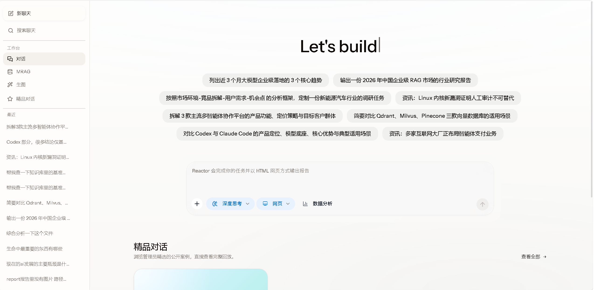

  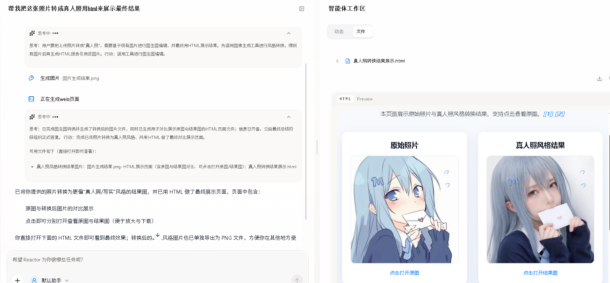
</p>


#### ReAct模式
<p align="center">
  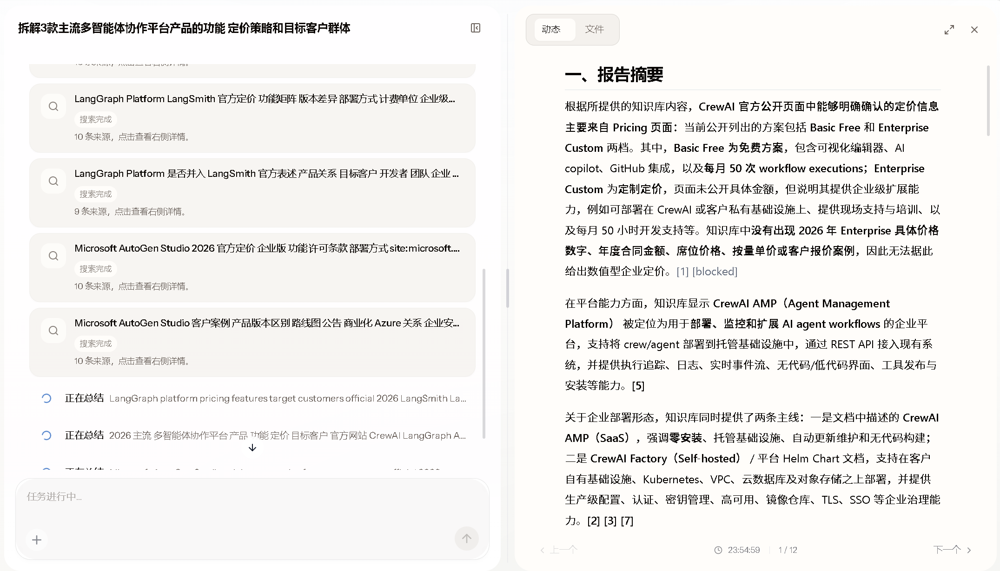
</p>

#### Plan Execute模式
<p align="center">
  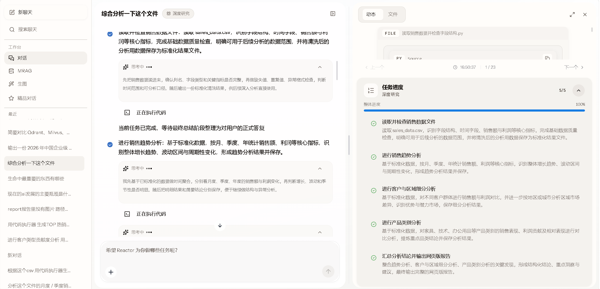
</p>


## ✨ 典型应用场景示例
#### 1.竞品分析场景与产品/日常调研场景：


##### 竞品分析：codex与claude code
<p align="center">
  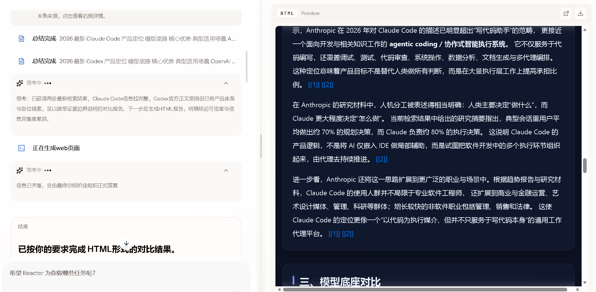
</p>

##### 日常调研:厦门一日游完整规划
<p align="center">
  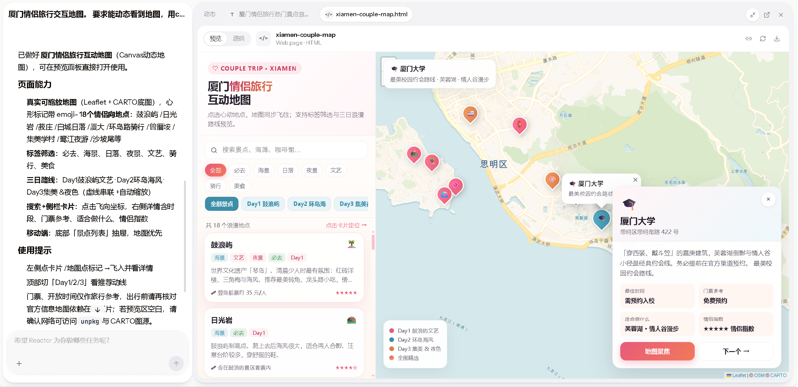
</p>

##### 产品调研：CodeGraph 开源项目调查报告
<p align="center">
  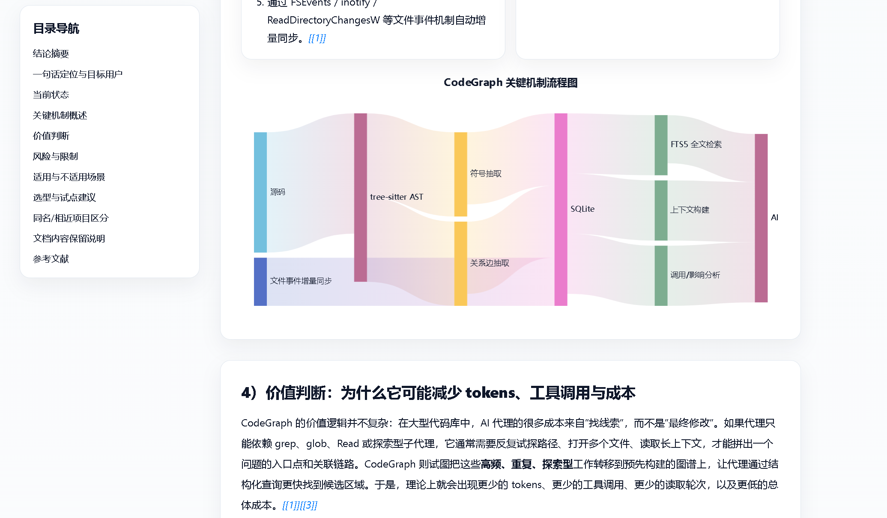
</p>


#### 2.内容生产类：人物海报生成

<p align="center">
  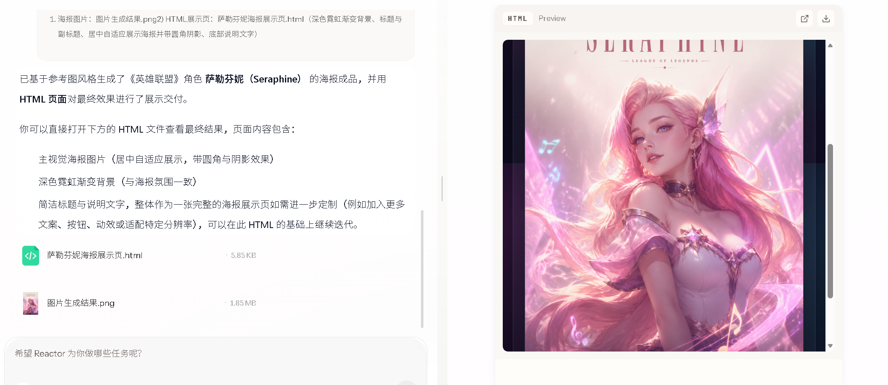

</p>

<p align="center">
  

</p>


#### 3.数据分析与可视化

<p align="center">
  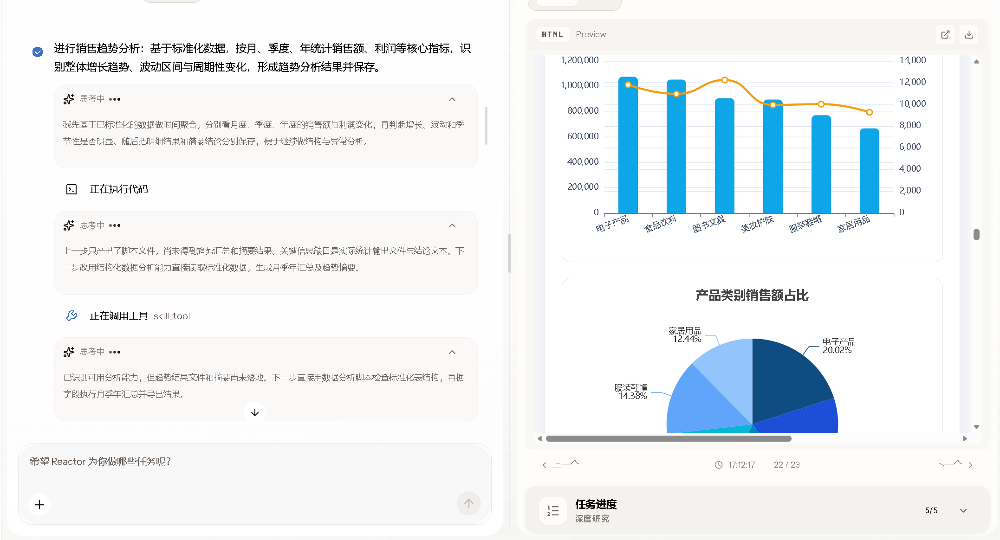

</p>

<p align="center">
  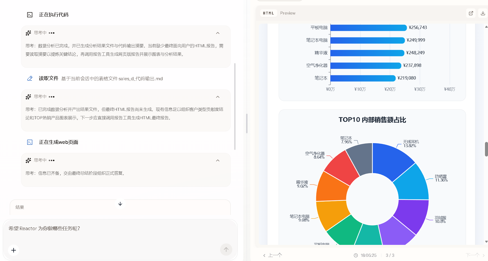

</p>

#### 4.行业研究类
##### RAG市场分析
<p align="center">
  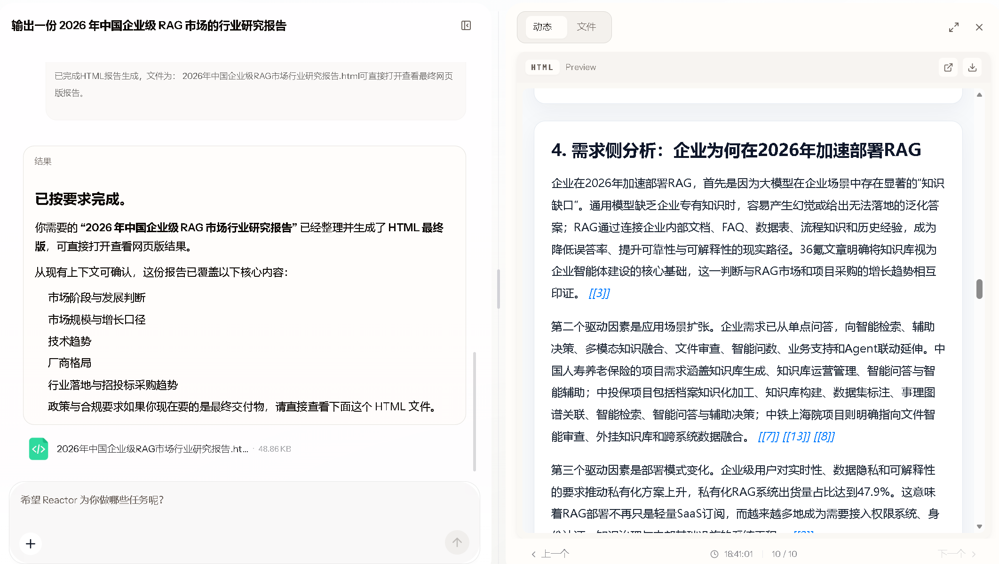

</p>

##### 主流Agent产品商业化研究
<p align="center">
  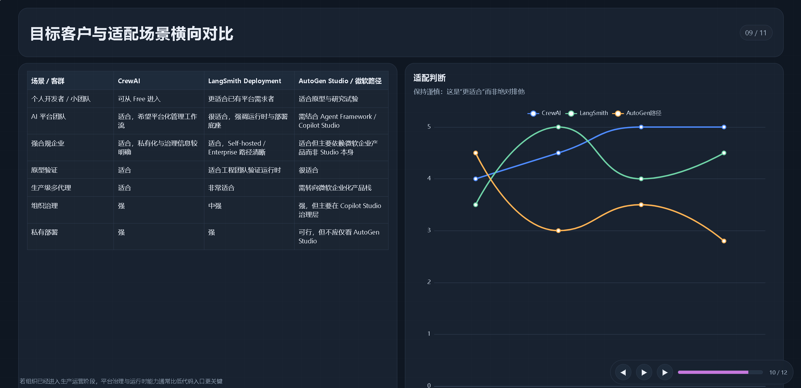

</p>

<p align="center">
  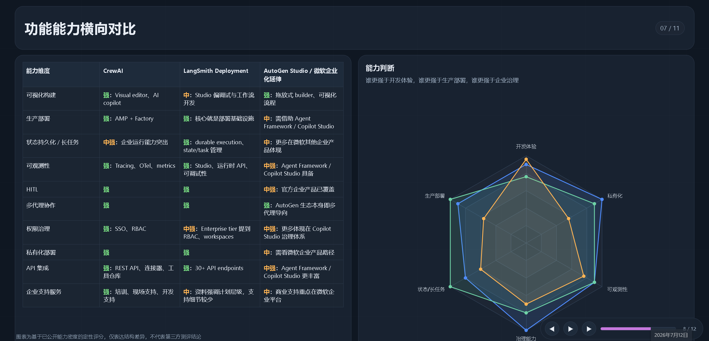

</p>

### 产物文件下载预览


| 分类 | 报告名称 | 格式 | 入口 |
| --- | --- | --- | --- |
| 技术评估 | [CodeGraph 开源项目调查报告](https://owwzo.top.owwzo.cloud/CodeGraph%E5%BC%80%E6%BA%90%E9%A1%B9%E7%9B%AE%E7%9C%8B%E6%B3%95%E4%B8%8E%E8%AF%84%E4%BC%B0.html) | HTML | [打开文件](https://owwzo.top.owwzo.cloud/CodeGraph%E5%BC%80%E6%BA%90%E9%A1%B9%E7%9B%AE%E7%9C%8B%E6%B3%95%E4%B8%8E%E8%AF%84%E4%BC%B0.html) |
| 模型选型 | [Agent 项目大模型性价比选型决策报告](https://owwzo.top.owwzo.cloud/Agent%E9%A1%B9%E7%9B%AE%E5%A4%A7%E6%A8%A1%E5%9E%8B%E6%80%A7%E4%BB%B7%E6%AF%94%E9%80%89%E5%9E%8B%E5%86%B3%E7%AD%96%E6%8A%A5%E5%91%8A.html) | HTML | [打开文件](https://owwzo.top.owwzo.cloud/Agent%E9%A1%B9%E7%9B%AE%E5%A4%A7%E6%A8%A1%E5%9E%8B%E6%80%A7%E4%BB%B7%E6%AF%94%E9%80%89%E5%9E%8B%E5%86%B3%E7%AD%96%E6%8A%A5%E5%91%8A.html) |
| 旅游决策 | [厦门情侣一日游完整规划](https://owwzo.top.owwzo.cloud/%E5%8E%A6%E9%97%A8%E6%83%85%E4%BE%A3%E4%B8%80%E6%97%A5%E6%B8%B8%E5%AE%8C%E6%95%B4%E8%A7%84%E5%88%92%E7%BD%91%E9%A1%B5%E7%89%88%E6%8A%A5%E5%91%8A.html) | HTML | [打开文件](https://owwzo.top.owwzo.cloud/%E5%8E%A6%E9%97%A8%E6%83%85%E4%BE%A3%E4%B8%80%E6%97%A5%E6%B8%B8%E5%AE%8C%E6%95%B4%E8%A7%84%E5%88%92%E7%BD%91%E9%A1%B5%E7%89%88%E6%8A%A5%E5%91%8A.html) |
| 场景案例 | [洛克王国新手攻略搜索总结](https://owwzo.top.owwzo.cloud/%E6%B4%9B%E5%85%8B%E7%8E%8B%E5%9B%BD%E6%96%B0%E6%89%8B%E6%94%BB%E7%95%A5%E6%90%9C%E7%B4%A2%E6%80%BB%E7%BB%93.html) | HTML | [打开文件](https://owwzo.top.owwzo.cloud/%E6%B4%9B%E5%85%8B%E7%8E%8B%E5%9B%BD%E6%96%B0%E6%89%8B%E6%94%BB%E7%95%A5%E6%90%9C%E7%B4%A2%E6%80%BB%E7%BB%93.html) |
| 技术框架研究 | [Spring AI 框架核心概念与架构演进报告](assets/readme/Spring_AI框架核心概念与架构演进报告.md) | Markdown | [打开文件](assets/readme/Spring_AI框架核心概念与架构演进报告.md) |
| 数据分析 | [客户类型贡献度分析与 TOP 热销产品统计](https://owwzo.top.owwzo.cloud/%E5%AE%A2%E6%88%B7%E7%B1%BB%E5%9E%8B%E8%B4%A1%E7%8C%AE%E5%BA%A6%E5%88%86%E6%9E%90%E4%B8%8E%E7%83%AD%E9%94%80%E4%BA%A7%E5%93%81%E6%8A%A5%E5%91%8A.html) | HTML | [打开文件](https://owwzo.top.owwzo.cloud/%E5%AE%A2%E6%88%B7%E7%B1%BB%E5%9E%8B%E8%B4%A1%E7%8C%AE%E5%BA%A6%E5%88%86%E6%9E%90%E4%B8%8E%E7%83%AD%E9%94%80%E4%BA%A7%E5%93%81%E6%8A%A5%E5%91%8A.html) |
| 数据分析 | [综合销售分析网页版报告](https://owwzo.top.owwzo.cloud/%E7%BB%BC%E5%90%88%E9%94%80%E5%94%AE%E5%88%86%E6%9E%90%E7%BD%91%E9%A1%B5%E7%89%88%E6%8A%A5%E5%91%8A.html) | HTML | [打开文件](https://owwzo.top.owwzo.cloud/%E7%BB%BC%E5%90%88%E9%94%80%E5%94%AE%E5%88%86%E6%9E%90%E7%BD%91%E9%A1%B5%E7%89%88%E6%8A%A5%E5%91%8A.html) |
| 竞品对比 | [Codex与ClaudeCode竞品分析报告](https://owwzo.top.owwzo.cloud/Codex%E4%B8%8EClaudeCode%E7%AB%9E%E5%93%81%E5%88%86%E6%9E%90%E6%8A%A5%E5%91%8A.html) | HTML | [打开文件](https://owwzo.top.owwzo.cloud/Codex%E4%B8%8EClaudeCode%E7%AB%9E%E5%93%81%E5%88%86%E6%9E%90%E6%8A%A5%E5%91%8A.html) |
| 竞品对比 | [主流笔记软件竞品分析报告](https://owwzo.top.owwzo.cloud/%E4%B8%BB%E6%B5%81%E7%AC%94%E8%AE%B0%E8%BD%AF%E4%BB%B6%E7%AB%9E%E5%93%81%E5%88%86%E6%9E%90%E6%8A%A5%E5%91%8A.html) | HTML | [打开文件](https://owwzo.top.owwzo.cloud/%E4%B8%BB%E6%B5%81%E7%AC%94%E8%AE%B0%E8%BD%AF%E4%BB%B6%E7%AB%9E%E5%93%81%E5%88%86%E6%9E%90%E6%8A%A5%E5%91%8A.html) |
| 竞品对比 | [三款主流多智能体协作平台对比拆解报告](https://owwzo.top.owwzo.cloud/%E4%B8%89%E6%AC%BE%E4%B8%BB%E6%B5%81%E5%A4%9A%E6%99%BA%E8%83%BD%E4%BD%93%E5%8D%8F%E4%BD%9C%E5%B9%B3%E5%8F%B0%E5%AF%B9%E6%AF%94%E6%8B%86%E8%A7%A3%E6%8A%A5%E5%91%8A.ppt.html) | PPT | [打开文件](https://owwzo.top.owwzo.cloud/%E4%B8%89%E6%AC%BE%E4%B8%BB%E6%B5%81%E5%A4%9A%E6%99%BA%E8%83%BD%E4%BD%93%E5%8D%8F%E4%BD%9C%E5%B9%B3%E5%8F%B0%E5%AF%B9%E6%AF%94%E6%8B%86%E8%A7%A3%E6%8A%A5%E5%91%8A.ppt.html) |
| 资讯收集 | [Linux内核新漏洞证明人工审计不可替代资讯报告](https://owwzo.top.owwzo.cloud/Linux%E5%86%85%E6%A0%B8%E6%96%B0%E6%BC%8F%E6%B4%9E%E8%AF%81%E6%98%8E%E4%BA%BA%E5%B7%A5%E5%AE%A1%E8%AE%A1%E4%B8%8D%E5%8F%AF%E6%9B%BF%E4%BB%A3%E8%B5%84%E8%AE%AF%E6%8A%A5%E5%91%8A.html) | HTML | [打开文件](https://owwzo.top.owwzo.cloud/Linux%E5%86%85%E6%A0%B8%E6%96%B0%E6%BC%8F%E6%B4%9E%E8%AF%81%E6%98%8E%E4%BA%BA%E5%B7%A5%E5%AE%A1%E8%AE%A1%E4%B8%8D%E5%8F%AF%E6%9B%BF%E4%BB%A3%E8%B5%84%E8%AE%AF%E6%8A%A5%E5%91%8A.html) |
| 行业信息收集 | [当前AI发展主要瓶颈分析报告 ](https://owwzo.top.owwzo.cloud/%E5%BD%93%E5%89%8DAI%E5%8F%91%E5%B1%95%E4%B8%BB%E8%A6%81%E7%93%B6%E9%A2%88%E5%88%86%E6%9E%90%E6%8A%A5%E5%91%8A%20.html) | HTML | [打开文件](https://owwzo.top.owwzo.cloud/%E5%BD%93%E5%89%8DAI%E5%8F%91%E5%B1%95%E4%B8%BB%E8%A6%81%E7%93%B6%E9%A2%88%E5%88%86%E6%9E%90%E6%8A%A5%E5%91%8A%20.html) |


## 技术栈

- 后端：Java 21、Spring Boot 3、Spring AI、MyBatis 、OkHttp SSE
- 数据层：MySQL、Qdrant
- 多模态智能检索：RAG、**多路混合**召回、Rerank、多轮检索
- 前端：React 19、TypeScript、Vite、Ant Design

## 系统架构图

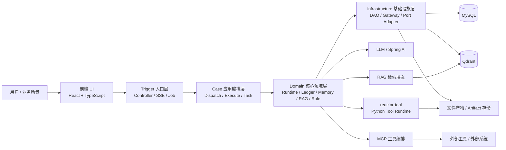

## 核心特色

### 1.子智能体远程挂载
将子智能体从进程内调用升级为 HTTP远程调用。每个子智能体是独立部署、独立扩缩容的服务，Java 编排中枢通过 HTTP SSE 流式协议调度执行。
这意味着：
- 横向扩展：哪个子智能体负载高，就单独扩哪个服务，无需整体扩容。比如：深度搜索请求堆积就加 Python 实例，MRAG 慢了加检索节点，互不影响。

- 对接外部工具/外部项目只需实现少量代码：接入新子智能体/工具 = 暴露一个 HTTP 端点 + 在主服务注册一个 Tool，无需改编排逻辑，能通过HTTP自由对接外部python/其他语言的项目，一定程度上接住了python的比较丰富的ai生态。

- 故障隔离与容错：子智能体崩溃不影响主服务和其他子智能体，超时有兜底，单个工具挂了也能让其他同类工具顶上

### 2. 会话级工作区
智能体产物自动落盘，支持文本、图片、HTML在线预览与下载。
- 工具产物登记与可见性机制，将搜索结果、分析文件、报告、图片、多模态检索结果统一沉淀到会话级工作区
- 支持跨工具传递、上下文续用与任务级结果串联，形成 `搜索 -> 分析 -> 报告 -> 汇总` 的**多工具组合闭环**
- 让前序工具生成的文件与中间结果可以被后续工具直接复用，避免链路割裂和重复处理

### 3.丰富的工具生态和深度集成
- DeepSearch 多引擎深度搜索，支持多轮检索+推理+总结
- Plantool	计划生命周期管理：创建→更新→标记步骤→完成
- CodeInterpreter	代码解释器，执行 Python 并返回结果
- Report	多格式报告生成（Markdown/HTML/PPT）
- WebFetch	单网页抓取，正文提取并落盘为 Markdown
- ImageGeneration	文生图 + 图生图，支持风格参考
- MultiModalAgent	跨模态检索，访问用户专属图文知识库
- FileTool	文件上传/解析/管理
- SkillTool系列工具 技能阅读/脚本执行

### 4.数字员工角色定位
- 数字员工 = 给 Agent 绑定一个"数字员工人设"，让同一个agent在不同任务背景下变成不同的角色。
如 file_tool → 市场洞察专员、DeepSearch Agent → 数据收集师

### 5.全链路流式输出
- Agent回复、工具输出、报告生成等等都是流式输出，提高应用可交互性，用户可感知到任务执行情况，避免长时间无响应

### 6.产物有丰富的展示形式(ppt、html、csv、markdown)
- report子智能体实现了多种信息展现形式，用户可按偏好选择。内置多种提示词模板(可自由配置成脑图、闪卡，也可继续基于已有信息展现形式做定制化，比如markdown形式分为简报文档、博客文章、学习指南)

## 核心能力

### 1. 多智能体协同与混合模式执行

- 设计并实现 `Plan Execute + ReAct` **混合执行**模式，并结合**动态replan机制**显著提升复杂任务的容错性 可拆解性与最终结果的准确性
- 支持将复杂任务拆解为多个**可并发**子任务，提升复杂场景下的可拆解性、执行效率与协同能力
- 支持**多策略** Agent 动态调度，按业务场景组织不同角色、不同能力的智能体协作完成目标

### 2. 基于CompletableFuture的多工具并发执行

- 在单个 Agent 的工具执行层支持对同一轮多个 `tool call` 并发调度，统一完成工具调用、事件推送、artifact 记录、账本落库与结果回写，避免“并发执行了，但状态各写各的”的工程失控

### 3. Skill能力库+SOP语义召回体系

- 任务规划之前先语义召回类似任务的SOP，参考召回的内容进行计划的生成
- 降低模型自由发挥导致的任务跑偏、步骤遗漏和结果不一致问题，提升多步骤任务的完成度与交付一致性
- 跨会话经验复用，用户可根据业务场景设置自定义SOP，自动指导agent工作

### 5. RAG 与混合检索增强

- 基于 Qdrant 搭建 **语义向量召回 + BM25 关键词召回 + 文本到图片/页面的跨模态混合检索体系**
- 结合**查询重写**、**子问题扩展**、**多轮检索**与**重排序**机制，提升图文混合知识场景下的检索相关性
- 支持复杂知识任务中的**证据补全**、上下文增强与多源内容融合

### 6. MCP管理

- 在运行时构建 `McpRegistry + McpToolExecutor` 统一管理 MCP 服务，启动后可对全局启用或指定客户端绑定的 MCP 做预热、工具发现与缓存，减少每次请求都重新建连和重复 `listTools` 的开销
- 支持三种MCP传输协议 `SSE`、`STDIO` 与 `Streamable HTTP` 

### 7. 完善的执行事实记录与执行历史回放

- 统一记录对话过程产生的执行事实，覆盖对话运行、LLM 调用、工具调用、工具输出、文件产物等关键节点
- 支持复杂任务链路的审计、问题定位与历史回放，提升 Agent 系统的可观测性与可维护性
- 通过结构化工具输出与 artifact 引用，支持前端按历史记录稳定恢复结果展示

## 执行链路图

### ReAct 链路

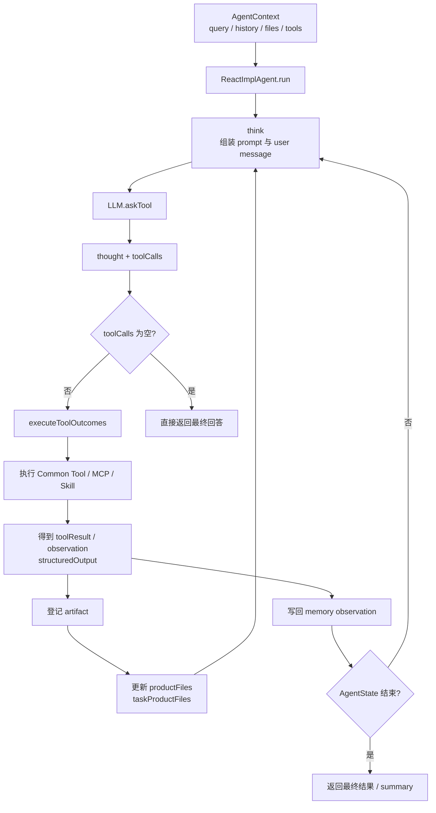

### PlanSolve 链路

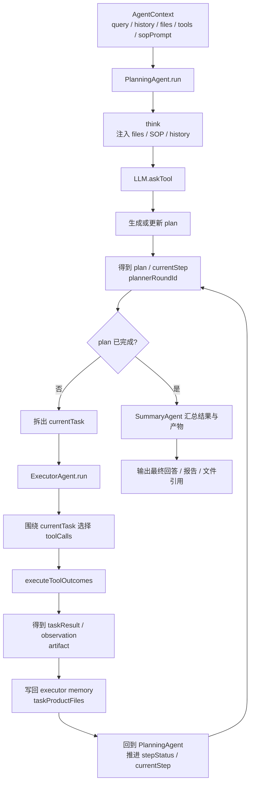

## 项目结构

```text
Reactor-agent/
├── Reactor-agent-types/                              # 基础类型层
│   └── src/main/java/org/wwz/ai/types/
│       ├── common/Constants.java                    # 全局常量
│       ├── exception/AppException.java              # 应用异常基类
│       ├── exception/BizException.java              # 业务异常
│       ├── enums/ResponseCode.java                  # 统一响应码
│       ├── agent/config/AgentExecutorProperties.java # Agent 执行器配置
│       ├── agent/config/AgentExecutorNames.java     # 执行器名称常量
│       └── agent/visitor/VisitorRequestContext.java # 访客请求上下文
├── Reactor-agent-api/                                # API 契约层
│   └── src/main/java/org/wwz/ai/api/
│       ├── IAiAgentService.java                     # Agent 主服务契约
│       ├── IAiClientToolMcpAdminService.java        # MCP 管理契约
│       ├── dto/AutoAgentRequestDTO.java             # 主对话请求 DTO
│       ├── dto/AiClientToolMcpRequestDTO.java       # MCP 配置 DTO
│       └── response/Response.java                   # 统一返回体
├── Reactor-agent-trigger/                            # 入口适配层
│   └── src/main/java/org/wwz/ai/trigger/
│       ├── http/reactor/ReactorController.java      # Reactor 主对话入口
│       ├── http/dataagent/DataAgentController.java  # 数据 Agent 入口
│       ├── http/agent/AgentConversationHistoryController.java # 历史会话接口
│       ├── http/agent/AgentFileController.java      # 文件接口
│       ├── http/admin/AiClientToolMcpAdminController.java # MCP 后台管理
│       ├── http/reactor/support/SseEmitterAgentSessionStream.java # SSE 输出适配
│       └── job/AgentTaskJob.java                    # 定时任务入口
├── Reactor-agent-case/                               # 应用编排层
│   └── src/main/java/org/wwz/ai/application/agent/
│       ├── dispatch/AgentDispatchService.java       # 执行策略路由
│       ├── execute/IExecuteStrategy.java            # 执行策略抽象
│       ├── execute/react/ReactAgentExecuteStrategy.java # ReAct 编排入口
│       ├── execute/planexecute/PlanSolveAgentExecuteStrategy.java # PlanSolve 编排入口
│       ├── execute/workflow/FlowAgentExecuteStrategy.java # Flow 编排入口
│       ├── armory/AgentArmoryApplicationService.java # 能力装配
│       ├── task/AgentTaskApplicationService.java    # 任务编排
│       ├── dataquery/DataAgentApplicationService.java # 数据问答编排
│       └── stream/AgentSessionPrinter.java          # 流式输出打印器
├── Reactor-agent-domain/                             # 领域核心
│   └── src/main/java/org/wwz/ai/domain/agent/
│       ├── runtime/agent/AgentContext.java          # 单次运行上下文
│       ├── runtime/agent/BaseAgent.java             # Agent 公共执行骨架
│       ├── runtime/agent/ReactImplAgent.java        # ReAct 内核实现
│       ├── runtime/agent/PlanningAgent.java         # PlanSolve 规划内核
│       ├── runtime/agent/ExecutorAgent.java         # PlanSolve 任务执行内核
│       ├── runtime/agent/SummaryAgent.java          # 总结收口 Agent
│       ├── runtime/llm/LLM.java                     # LLM 调用封装
│       ├── runtime/llm/StreamResponseHandler.java   # 流式响应处理
│       ├── runtime/tool/ToolCollection.java         # 工具集合
│       ├── runtime/tool/factory/AgentToolCollectionFactory.java # 工具装配工厂
│       ├── runtime/tool/mcp/runtime/McpRegistry.java # MCP 运行时注册中心
│       ├── runtime/tool/mcp/runtime/McpToolExecutor.java # MCP 工具执行器
│       ├── runtime/tool/skill/DefaultSkillRegistry.java # Skill 注册中心
│       ├── runtime/artifact/ToolArtifactRegistry.java # 工具产物登记
│       ├── runtime/executor/AgentExecutorSupport.java # 并发执行器封装
│       ├── memory/SessionContextMemoryService.java  # 会话记忆入口
│       ├── ledger/AgentExecutionRecorder.java       # 执行账本写接口
│       ├── ledger/ExecutionLedgerQueryService.java  # 执行账本读接口
│       ├── ledger/ExecutionLedgerRunSupport.java    # 运行账本辅助
│       ├── ledger/replay/ConversationHistoryReplayService.java # 历史回放服务
│       ├── ledger/replay/projector/ToolInvocationProjectorRegistry.java # 工具回放投影注册
│       ├── rag/DataAgentQueryService.java           # 数据问答领域入口
│       ├── rag/Nl2SqlQueryService.java              # 自然语言转 SQL
│       ├── rag/SchemaRecallService.java             # Schema 召回
│       ├── rag/SopRecallService.java                # SOP 召回
│       └── role/FixRoleService.java                 # 固定角色服务
├── Reactor-agent-infrastructure/                     # 基础设施层
│   └── src/main/java/org/wwz/ai/infrastructure/
│       ├── adapter/repository/AgentRepository.java  # Agent 仓储实现
│       ├── adapter/repository/ExecutionLedgerWriteRepository.java # 账本写仓储
│       ├── adapter/repository/ExecutionLedgerReadRepository.java # 账本读仓储
│       ├── adapter/repository/ChatModelMetadataRepository.java # 模型元数据仓储
│       ├── adapter/port/OkHttpRemoteStreamAdapter.java # 远端流式适配
│       ├── adapter/port/OkHttpRemoteHttpAdapter.java # 远端 HTTP 适配
│       ├── adapter/port/ReactorToolFileArtifactAdapter.java # 工具产物适配
│       ├── tooloutput/ToolOutputWriterImpl.java     # 工具输出持久化
│       ├── tooloutput/ToolOutputReaderImpl.java     # 工具输出读取
│       ├── dataquery/DataQueryExecutionAdapter.java # 数据查询执行适配
│       ├── dataquery/DataQueryMetadataAdapter.java  # 数据元信息适配
│       ├── gateway/ReactorFileGateway.java          # 文件网关
│       ├── gateway/ReactorImageGenerationGateway.java # 图像生成网关
│       └── dao/reactor/                             # DialogueRun / ToolInvocation / ToolOutput 持久化 DAO
├── Reactor-agent-app/                               # 启动与装配层
│   ├── src/main/java/org/wwz/ai/Application.java    # Spring Boot 启动入口
│   ├── src/main/java/org/wwz/ai/config/AgentExecutorConfiguration.java # 执行器装配
│   ├── src/main/java/org/wwz/ai/config/AiAgentAutoConfiguration.java # Agent 主装配
│   ├── src/main/java/org/wwz/ai/config/AiAgentSkillAutoConfiguration.java # Skill 装配
│   ├── src/main/java/org/wwz/ai/config/reactor/ReactorRuntimeAutoConfiguration.java # Reactor 运行时装配
│   ├── src/main/java/org/wwz/ai/config/reactor/ReplayProjectorAutoConfiguration.java # 历史回放装配
│   ├── src/main/java/org/wwz/ai/config/reactor/DataAgentInitRunner.java # 数据 Agent 初始化
│
├── ui/                                              # React 前端
│   ├── package.json                                 # 前端依赖与脚本
│   ├── vite.config.ts                               # Vite 配置
│   └── src/
│       ├── main.tsx                                 # 前端启动入口
│       ├── App.tsx                                  # 应用根组件
│       ├── router/routes.ts                         # 路由定义
│       ├── components/ChatView/index.tsx            # 主聊天视图
│       ├── components/ChatView/useConversationStream.ts # SSE 会话流处理
│       ├── components/Dialogue/index.tsx            # 对话渲染
│       ├── components/Dialogue/PlanSection.tsx      # 计划结果展示
│       ├── services/agent.ts                        # Agent 接口封装
│       ├── services/agentConversation.ts            # 历史会话接口封装
│       ├── services/agentFile.ts                    # 文件接口封装
│       ├── services/imageGeneration.ts              # 图像生成接口封装
│       ├── services/mragWorkspace.ts                # MRAG 工作区接口封装
│       ├── pages/Home/index.tsx                     # 主对话页
│       ├── pages/WorkspaceMRag/index.tsx            # MRAG 工作区
│       └── pages/WorkspaceImageGeneration/index.tsx # 图像生成工作区
├── runtime/                                         # 已纳入仓库的运行时资源与技能目录
├── assets/                                          # 项目静态资源
├── pom.xml                                          # Maven 聚合构建入口
└── README.md                                        # 项目说明
```


## 架构说明

- `trigger`：负责 HTTP / SSE / Job 等外部入口协议适配
- `case`：负责多智能体编排、任务调度、执行组织与能力协调
- `domain`：负责 Agent runtime、执行账本、记忆、RAG、角色能力等核心领域语义
- `infrastructure`：负责 DAO、外部服务、文件、远端工具、检索与持久化适配
- `app`：负责 Spring Boot 装配、配置绑定与运行时启动


## 后续演进方向

- 更智能的多 Agent 协作策略与角色编排
- 更完善的管理后台、配置中心与可观测性能力
- 更丰富的工具组合
- 构建长期记忆，记录用户偏好与使用习惯，形成稳定用户画像，让智能体在持续交互中更懂用户
- 多知识源接入 支持 Dify、Notion、飞书（规划中）等外部知识源接入，统一检索与引用
