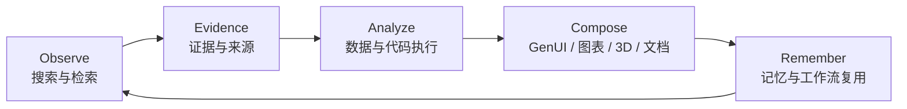
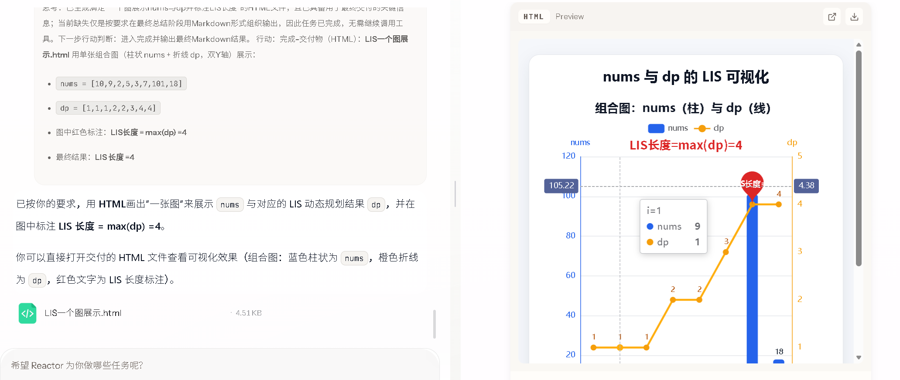
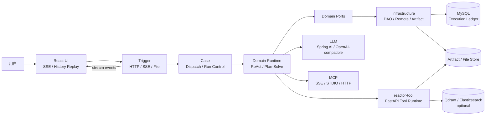

<p align="center">
  
</p>

<h1 align="center">Reactor</h1>

<p align="center">
  <strong>让世界的变化进入你的工作流</strong>
</p>

<p align="center">
  一个面向持续研究与复杂任务执行的可回放 Agent 工作站：发现信号，形成证据，执行分析，发布成果。
</p>

<p align="center">
  A world-aware, tool-using Agent workstation for research, analysis, and interactive delivery.
</p>

<p align="center">
  
  
  
  
  
  
</p>

<p align="center">
  <a href="#核心闭环">核心闭环</a> ·
  <a href="#能力地图">能力地图</a> ·
  <a href="#协作与控制">协作与控制</a> ·
  <a href="#系统架构">系统架构</a> ·
  <a href="#快速开始">快速开始</a> ·
  <a href="https://github.com/OWWZO/ai-agent">GitHub</a>
</p>

<p align="center">
  
</p>

> **项目状态**：Reactor 仍在持续演进。基础 Agent 执行链路可以独立运行；搜索、向量检索、图像生成、代码沙箱和长期记忆等能力需要根据部署环境配置对应的模型或外部服务。README 中的“持续关注”指可组合的定时任务、后台 Agent 和跨轮记忆能力，不代表所有部署默认开启无人值守监控。

## 定位

Reactor 是一个让 Agent 持续关注世界、理解变化并交付结果的开源 Agent 应用底座，由 Java Agent Runtime、React 工作台和 Python Tool Runtime 组成。

它把一次请求视为一条可以观察、干预、持久化和回放的执行记录，而不是一段临时对话：

```text
世界信号 / 用户目标
  -> 多源搜索与知识检索
  -> 任务规划与多 Agent 协作
  -> 代码、数据与工具执行
  -> 结构化产物与可交互展示
  -> 记忆沉淀、执行审计与历史回放
```

Reactor 适合构建深度研究、世界动态追踪、知识库问答、数据分析、内容生产和内部自动化等需要多步执行的 AI 应用。

## 核心闭环



这个闭环对应三个主要产品动作：

1. **关注世界**：从公开互联网、用户授权的社交来源、私有知识库和业务数据库中发现变化。
2. **理解世界**：通过多 Agent、RAG、NL2SQL 和受控代码执行，把资料转成可检查的证据和分析结果。
3. **表达世界**：把结果发布成 GenUI、图表、HTML、PDF、Word、PPT 或可交互的 3D 场景，并保留来源和执行记录。

## 为什么是 Reactor

普通聊天应用把重点放在生成一段答案，Reactor 把重点放在完成一项可交付的工作：来源可以追踪，过程可以观察，关键节点可以由人决定，结果可以继续被工具和下一轮任务消费。

| 关注点 | Reactor 的做法 | 带来的结果 |
| --- | --- | --- |
| 世界感知 | DeepSearch、多引擎搜索、公开来源、授权社媒、私有知识库和业务数据库 | 信息采集不局限于单一网页或单一知识库 |
| 执行能力 | ReAct、Plan-Solve、Workflow、工具循环和并发调度 | 复杂目标可以拆解、执行和收口 |
| 分析能力 | MRAG、NL2SQL、Python 数据分析和受控代码执行 | 结构化与非结构化资料可以联合推理 |
| 交付能力 | GenUI、图表、HTML、PDF、Word、PPT、图片和 3D 场景 | 答案可以直接成为工作成果 |
| 控制能力 | 计划审批、用户追问、停止、恢复、断线续观和运行中注入指导 | 人可以在关键步骤接管 Agent |
| 可追踪性 | Execution Ledger 记录 Run、LLM、Tool、Artifact 和结构化输出 | 任务过程可以审计、回放和复盘 |

## 能力地图

### 1. Observe：搜索、媒体与 RAG

Reactor 将“搜索”视为一个可以继续执行的研究过程，而不是一次关键词查询。

- **DeepSearch**：查询拆解、多轮 `extend/search/report` 阶段、并发检索、正文抓取、去重、摘要和 SSE 流式进度。
- **多搜索引擎**：按配置接入 DuckDuckGo、Exa、Tavily、Brave、Grok/OpenAI-compatible 等搜索后端；默认部署可选择轻量搜索引擎。
- **公域来源**：网页、RSS、YouTube、B站、GitHub、Reddit RSS、Hacker News、Stack Exchange、V2EX、Telegram 公开频道等，主要通过 `Skill Runtime` 和 Python Tool Runtime 接入。
- **授权私域媒体**：Twitter/X、Reddit、雪球提供只读工具，认证信息只从服务端环境变量读取，不读取浏览器 Cookie，也不执行发帖、点赞、交易等写操作。
- **可扩展来源**：其他社交平台可以通过浏览器自动化、MCP 或 Skill 接入。小红书/XHS 在当前版本中应视为待接入的浏览器扩展能力，不作为内置适配器承诺。
- **可溯源结果**：保留原始 URL、标题、作者、时间、文档、chunk、页面和图片元数据；这让检索证据和后续产物能够关联起来，但不等同于模型答案天然正确。

### 2. Analyze：数据、代码与安全执行

同一个任务可以同时处理网页、PDF、Word、图片、表格、数据库和生成的中间文件。

- **可溯源多模态 RAG / MRAG**：支持 PDF、Word、PowerPoint、Markdown、文本和图片解析，结合 OCR、caption、文本向量、图片向量、BM25、页面检索和重排序。
- **结构化数据分析**：Table RAG、schema/列值召回、Text-to-SQL（NL2SQL）、SQL 执行、数据预览和模型元数据检索。
- **非结构化数据分析**：文档切分、跨文档召回、图片候选、检索 trace 和带上下文生成。
- **CodeAct 风格执行**：Agent 通过“生成代码 → 执行 → 观察结果 → 修正计划”的循环完成清洗、统计、计算和可视化，代码与执行结果也可以作为产物交付。
- **E2B 沙箱**：支持 E2B 云沙箱、持久 kernel、工作区上传、文件 diff、产物下载和沙箱销毁；本地执行后端适合可信开发环境，生产环境应使用隔离沙箱和显式权限策略。
- **会话工作区**：每个会话拥有受控 workspace，工具通过路径守卫读写文件，后续 Agent 可以继续消费前序工具产物。

### 3. Compose：GenUI、画布与文档产物

Reactor 不要求所有结果都停留在 Markdown 中。Agent 可以输出结构化 UI 和内容数据，由稳定的 Renderer 负责呈现。

- **GenUI**：模型生成受控的 UI Tree，使用增量 JSON Patch 演进画布状态，并由 React 按白名单组件渲染。
- **画布发布**：支持 `emit_ui_tree`、`emit_ui_patch` 和 `canvas_publish`，可将 HTML 产物预览、下载并进入历史回放。
- **可视化组件**：图表、表格、卡片、流程、时间线、表单、HTML、图片、视频和交互式内容。
- **3D 展示**：内置 Three.js 场景和 `Model3D` 组件，可展示参数化几何、GLB/GLTF 模型和可交互的 3D 结果。
- **无限画布方向**：当前核心是受控 GenUI Tree、Patch 和 Canvas Preview，数据模型为更大的空间画布演进保留了基础；真正的无限平移、缩放和多区域编排取决于前端画布实现。
- **文档生成**：支持 PDF、DOCX、PPTX、HTML、Markdown、Excel 和图表等产物，文件统一进入 Artifact 管理。
- **主题与内容解耦**：PDF/Word/PPT/HTML 渲染器共享命名主题和自定义主题配置。推荐让 Agent 输出内容 JSON，让 Renderer 根据预配置主题负责字体、颜色、布局和格式转换。

### Tool Fabric：工具、Skill 与 MCP

- **内置工具**：`deepsearch`、`web_fetch`、`mragQuery`、`table_rag`、`nl2sql`、`code_interpreter`、`data_analysis`、`dataprep`、`chart_generator`、`document_generate`、`slides_generate`、`image_generation`、`workspace_*` 和 `canvas`。
- **Skill Runtime**：从 `runtime/skills/<skill-name>/` 加载 `SKILL.md`、参考资料和脚本；支持目录扫描、脚本发现、会话物化、路径防护和超时控制。
- **MCP**：通过 Server Descriptor、Registry 和 Executor 发现并调用外部工具，支持 SSE、STDIO 和 Streamable HTTP 传输方式。
- **远程工具运行时**：`reactor-tool` 基于 FastAPI 承载搜索、RAG、数据处理、文件服务、文档生成和代码执行等重型能力。

## 协作与控制

### Multi-Agent：同步 + 异步

Reactor 支持把一个复杂目标拆给多个职责明确的 Agent，并让主 Agent 继续推进。

- **同步子 Agent**：默认等待子任务结果，适合需要即时汇总的检索、分析和验证步骤。
- **异步后台 Agent**：设置 `run_in_background=true` 后，长任务在后台运行，主对话可以继续处理其他工作。
- **任务控制**：支持查询后台任务结果、停止任务、恢复观察和向运行中的 Agent 注入指导。
- **上下文隔离**：子 Agent 可以拥有独立的工具集合、memory scope 和会话工作区，避免无关工具和上下文相互污染。
- **协作通信**：父子 Agent 通过 session 级 mailbox 传递消息；当前实现是进程内协作机制，不等同于跨进程可靠消息队列。

### Human-in-the-loop

Agent 不必在所有步骤上自动做决定。Reactor 在执行链路中提供可恢复的人机协作节点：

```text
生成计划 -> 等待审批 -> 执行任务 -> 遇到不确定性 -> 向用户提问 -> 继续执行
```

- 计划审批：`approve`、`reject`、`resume`、`cancel`
- 用户追问：`AskUserQuestion`、回答、恢复和取消
- 运行控制：停止 Run、断线后 `follow`、运行中注入新的指导
- 前端恢复：刷新或重新连接后恢复待审批、待回答和后台运行状态

## 记忆与上下文

### 三层长期记忆模型

Reactor 将长期能力组织成三种记忆，便于理解不同信息应该如何沉淀：

| 记忆类型 | 记录内容 | 当前实现映射 |
| --- | --- | --- |
| **语义记忆** | 用户偏好、长期事实、稳定知识和策展内容 | `curated memory`、可选 LTM Provider |
| **情景记忆** | 过去的会话、任务、工具调用、文件和分析结果 | Execution Ledger、工作记忆投影、历史回放 |
| **程序性记忆** | 如何完成一类任务的 Skill、SOP、脚本和执行经验 | `runtime/skills/`、SOP 召回和工具流程 |

当前版本的“语义 / 情景 / 程序性”是产品层的组织模型，底层仍由不同的 Provider、Ledger 和 Skill 机制分别承载；长期记忆 Provider 默认是可选的。

### 上下文压缩

长任务和长会话会自动进入上下文治理流程：

- 跨轮对话从工作记忆投影 hydrate，保留下一轮 LLM 所需的消息结构。
- 接近上下文预算时执行摘要压缩，保护任务目标、关键早期信息和最近工具结果。
- 支持 LLM 摘要、局部压缩、失败回退和 mid-run 压缩。
- 压缩前可以触发长期记忆 flush，压缩事件和输入输出快照可审计。
- 工作记忆用于下一轮上下文，历史回放仍以 Execution Ledger 为事实来源。

## 典型任务

| 场景 | 执行链路 | 主要能力 |
| --- | --- | --- |
| 世界动态追踪 | 主题订阅 → 多源搜索 → 社媒信号 → 趋势摘要与来源报告 | DeepSearch、Public Sources、授权社媒、SOP |
| 财报与竞品研究 | 问题拆解 → 网页/视频/社区检索 → 证据整理 → HTML/Canvas 报告 | Plan-Solve、DeepSearch、MCP、GenUI |
| 数据分析 | 读取数据库或文件 → NL2SQL → Python 清洗与统计 → 图表和报告 | Table RAG、CodeAct、E2B、Chart |
| 知识库问答 | 文档解析 → 文本/图片多路召回 → 重排序 → 带上下文回答 | MRAG、Qdrant、BM25、OCR |
| 内容生产 | 主题研究 → 结构化内容 → 选择主题 → PDF/Word/PPT/网页交付 | Skill、Document、Slides、Artifact |
| 交互式展示 | 生成 UI Tree → 增量 Patch → HTML/Three.js/Model3D → 发布与回放 | GenUI、Canvas、Three.js |

## 运行展示

<p align="center">
  
  
</p>

<p align="center">
  
  
</p>

<p align="center">
  
  
</p>

<p align="center">
  
  
</p>

### 一条完整任务链

例如，用户提出“梳理某公司最近四个季度财报、社区讨论和竞品动态，做成一份可交互投研报告”：

1. `Plan-Solve` 拆分检索、验证、分析和交付步骤。
2. `DeepSearch` 从多搜索引擎、网页、视频和授权社媒读取候选信息。
3. `MRAG` 对上传的财报、图片和历史资料进行多模态召回。
4. Python Tool Runtime 在受控工作区中完成表格清洗、指标计算和图表生成。
5. Agent 输出报告内容和 GenUI 结构化数据，Renderer 应用主题并生成 HTML、PDF、Word 或 PPT。
6. 每个 Run、工具调用、来源和产物进入 Execution Ledger，用户可以继续观察或回放任务。

## 快速开始

### 环境要求

- JDK 21
- Maven 3.8+
- Node.js 18+ 与 pnpm
- Python 3.11+ 与 uv
- MySQL 8
- 一个 OpenAI-compatible LLM API
- Qdrant、Elasticsearch、图像模型、搜索服务和 E2B 沙箱均为可选能力

### 1. 获取代码

```bash
git clone https://github.com/OWWZO/ai-agent.git
cd ai-agent
```

### 2. 初始化数据库

创建与开发配置一致的数据库，并导入以下脚本。也可以使用自定义数据库名，但需要同步修改 `application-dev.yml` 中的连接地址。

```bash
mysql -u root -p -e "CREATE DATABASE IF NOT EXISTS \`ai-agent-station\` CHARACTER SET utf8mb4 COLLATE utf8mb4_unicode_ci"
mysql -u root -p ai-agent-station < Reactor-agent-app/src/main/resources/db/schema.sql
mysql -u root -p ai-agent-station < Reactor-agent-app/src/main/resources/db/data.sql
```

运行时模型目录至少需要一条启用的 `ai_client_api` 与 `ai_client_model` 配置，填写 OpenAI-compatible API 的 `base_url`、`api_key` 和 `model_name`。问数示例数据由 `data.sql` 提供。

### 3. 启动 Python Tool Runtime

`reactor-tool` 默认监听 `1601` 端口，负责远程工具、文件服务和部分 RAG 能力。

```bash
cd reactor-tool
uv sync
cp .env_template .env
# 编辑 .env，至少配置 OPENAI_API_KEY 与 OPENAI_BASE_URL

# 首次启动初始化文件服务 SQLite 元数据（只需执行一次）
# 默认创建 reactor-tool/autobots.db，并建立 FileInfo 表
uv run python -m reactor_tool.db.db_engine

./start.sh
```

Windows PowerShell：

```powershell
cd reactor-tool
uv sync
Copy-Item .env_template .env
# 编辑 .env 后执行
# 首次启动初始化文件服务 SQLite 元数据（只需执行一次）
# 默认创建 reactor-tool\autobots.db，并建立 FileInfo 表
uv run python -m reactor_tool.db.db_engine
.\start.ps1
```

`SQLITE_DB_PATH` 控制文件服务元数据库位置。默认值为 `autobots.db`，相对路径相对于 `reactor-tool` 目录。该初始化命令使用 SQLModel 的 `FileInfo` 元数据幂等建表；修改路径后，请先在当前终端设置同名环境变量再执行命令。MRAG 使用的 `SQLITE_PATH` 由对应 Store 在首次使用时自动创建表。

### 4. 启动 Java Backend

在新的终端回到仓库根目录：

```bash
mvn -pl Reactor-agent-app -am package '-Dmaven.test.skip=true'
java -jar Reactor-agent-app/target/Reactor-agent-app.jar
```

Backend 默认监听 `http://127.0.0.1:8100`。健康检查：

```bash
curl http://127.0.0.1:8100/web/health
```

### 5. 启动 React 工作台

```bash
cd ui
pnpm install
pnpm dev
```

打开 [http://localhost:3000](http://localhost:3000)。本地开发环境通过 `ui/.env` 中的 `SERVICE_BASE_URL` 连接 Java Backend。

### Docker Compose 部署

仓库根目录的 `Dockerfile` 与 `docker-compose.yml` 是当前唯一的容器部署入口，包含 MySQL、Java Backend、`reactor-tool` API/sandbox 进程和 Nginx 前端反代。

```bash
cp reactor-tool/.env_template reactor-tool/.env
# 编辑 reactor-tool/.env，至少填写 MySQL 密码、OPENAI_BASE_URL 和 OPENAI_API_KEY

docker compose --env-file reactor-tool/.env build

# 首次创建 reactor-data 卷后初始化文件服务 SQLite 元数据
# Compose 会将 SQLITE_DB_PATH 设置为 /data/autobots.db，并写入持久化卷
docker compose --env-file reactor-tool/.env run --rm --no-deps --entrypoint python reactor-tool -m reactor_tool.db.db_engine

docker compose --env-file reactor-tool/.env up -d
```

启动后访问 [http://localhost:3000](http://localhost:3000)，探活接口为 [http://localhost:3000/web/health](http://localhost:3000/web/health)。也可以从 `Reactor-agent-app` 目录执行 `./build.sh` 构建全部镜像。

Java 生产配置模板是 [`application-prod.yml`](Reactor-agent-app/src/main/resources/application-prod.yml)，以静态配置为主，已清除真实密钥和密码；部署者需要按实际环境填写空缺凭证和地址。MySQL 初始化脚本只会在首次创建 `mysql-data` 卷时执行；修改 `schema.sql` 或 `data.sql` 后需要按实际情况迁移已有数据库。

`reactor-data` 卷保存 Python 文件服务的 `autobots.db`、MRAG SQLite 元数据和文件产物。普通 `docker compose down` 不会删除该卷；如果执行 `docker compose down -v` 或手动删除 `reactor-data`，下次部署需要重新执行 SQLite 初始化命令。

### 给 Coding Agent 的部署 Prompt

```text
你是本仓库的部署代理。请先阅读 README.md、CLAUDE.md 以及相关模块说明，默认使用源码部署，不要默认使用 Docker Compose；只有用户明确要求容器部署时才切换到 Docker。开始前检查 JDK 21、Maven 3.8+、MySQL 8、Python 3.11+、uv、Node.js 18+ 和 pnpm，检查 Git 工作区并保留用户已有改动，禁止 reset、checkout 或覆盖未提交文件。按照 README 的顺序配置并启动 MySQL、reactor-tool、Reactor-agent-app 和 ui：没有 reactor-tool/.env 时从 reactor-tool/.env_template 创建，但不要覆盖已有 .env；首次启动执行 `uv run python -m reactor_tool.db.db_engine` 初始化 autobots.db；创建或确认 MySQL 数据库后导入 db/schema.sql 和 db/data.sql；使用 application-prod.yml 作为无真实凭证的部署配置，保留源码部署所需的 127.0.0.1 服务地址，不要把 application-dev.yml 中的真实密钥复制到生产配置。只使用用户明确提供的 LLM、搜索、E2B、Qdrant、ES、OCR、对象存储和登录态凭证，绝不能猜测、生成或输出这些凭证；如果缺少 MySQL 密码、LLM_BASE_URL/OPENAI_BASE_URL、OPENAI_API_KEY、模型名或其他必需配置，停止启动并列出变量名、用途和示例格式。先启动 reactor-tool，再用 `mvn -pl Reactor-agent-app -am package '-Dmaven.test.skip=true'` 构建并启动 Java Backend，最后在 ui 执行 `pnpm install` 和 `pnpm dev`。启动后检查 reactor-tool、`http://127.0.0.1:8100/web/health` 和 `http://localhost:3000`，失败时读取日志并修复配置后重试。只有健康检查通过、SQLite 初始化完成且没有把敏感信息写入 README、日志或 Git 跟踪文件时，才报告部署成功；最后列出实际执行命令、访问地址、数据库和 SQLite 文件位置、仍未配置的可选能力以及需要用户后续处理的事项。不要修改业务代码或删除数据，除非用户明确授权。
```

## 系统架构

### 异构多服务

Reactor 把实时 Agent 编排和重型工具执行拆开：Java 负责运行时、策略、会话、HITL 和执行账本；Python 负责搜索、RAG、数据处理、文档生成和代码沙箱；React 负责流式工作台、产物预览和 GenUI 渲染。三者通过 HTTP、SSE、MCP 和文件服务协作。



### 请求生命周期

1. `trigger` 接收 HTTP 请求，建立访客、会话和 SSE 输出上下文。
2. `case` 根据 `AgentType` 选择 `ReAct`、`Plan-Solve` 或 `Workflow` 执行策略。
3. `domain runtime` 组装 Agent Context、Memory、Skill、MCP 和工具集合，并按需创建同步或后台子 Agent。
4. LLM 产生文本或 Tool Call；Python Tool Runtime 执行搜索、RAG、代码、数据和文档工具。
5. 工具结果、观察信息和产物回写到运行上下文，关键步骤可以进入 HITL 等待状态。
6. `infrastructure` 将 Run、LLM Invocation、Tool Invocation、Artifact 和结构化输出写入账本。
7. SSE 将过程实时投影到 UI；历史页面从 Execution Ledger 重新投影展示结果，不重新执行原任务。

### 服务职责

| 服务 / 层 | 主要职责 | 典型能力 |
| --- | --- | --- |
| React Workbench | 实时交互与结果呈现 | SSE、对话、计划、后台任务、文件预览、GenUI、3D |
| Java Agent Runtime | Agent 生命周期和任务编排 | ReAct、Plan-Solve、Workflow、Memory、HITL、Ledger |
| Python Tool Runtime | 重型工具和数据计算 | DeepSearch、MRAG、NL2SQL、CodeAct、文档生成 |
| E2B / Sandbox | 代码执行隔离边界 | 持久 kernel、工作区同步、超时、权限和产物采集 |
| MySQL / Artifact Store | 执行事实与文件引用 | Run、LLM、Tool、Artifact、结构化工具输出 |
| Qdrant / Elasticsearch | 可选检索基础设施 | 向量召回、表结构检索、列值召回和重排序 |

### DDD 模块边界

| 模块 | 职责 |
| --- | --- |
| `Reactor-agent-types` | 常量、枚举、异常和通用类型 |
| `Reactor-agent-api` | DTO 与应用服务契约 |
| `Reactor-agent-trigger` | HTTP、SSE、文件、会话和运行控制入口 |
| `Reactor-agent-case` | Agent 分发、执行策略、会话流与应用编排 |
| `Reactor-agent-domain` | Runtime、Memory、RAG、Role、Ledger 与领域 Port |
| `Reactor-agent-infrastructure` | MyBatis、远程 HTTP/SSE、文件、数据查询和外部服务适配 |
| `Reactor-agent-app` | Spring Boot 启动、配置和运行时装配 |
| `ui` | React 工作台、流式对话、计划和产物展示 |
| `reactor-tool` | FastAPI 工具运行时、文件服务、搜索、沙箱和 RAG 能力 |

## Execution Ledger

Execution Ledger 是 Reactor 运行时的唯一执行事实主路径。它让“模型说了什么、工具做了什么、产出了什么、任务如何结束”都拥有稳定的持久化边界。

它不是一张简单的聊天消息表，而是一组围绕执行过程组织的事实记录：一次用户请求对应一个 Run，一个 Run 可以包含多次 LLM 调用、工具调用、子 Agent 调用和文件产物。

| 表 | 语义 |
| --- | --- |
| `ai_agent_dialogue_session` | 会话头、标题、统计和最近活跃时间 |
| `ai_agent_dialogue_run` | 一次用户请求对应的一次执行 Run |
| `ai_agent_llm_invocation` | 每次模型调用及其用量、状态和响应信息 |
| `ai_agent_tool_invocation` | 每次工具调用、参数、状态和父子关系 |
| `ai_agent_tool_output_*` | 按工具类型拆分的结构化输出 |
| `ai_agent_artifact` | 上传文件、生成文件和稳定产物引用 |
| `ai_agent_working_memory_*` | 面向下一轮 LLM 上下文的工作记忆投影 |

历史回放读取账本并生成展示投影；工作记忆只服务跨轮上下文 hydrate，不作为 UI 历史回放的第二套事实源。回放是重新投影历史事实，不会重新执行原任务。当前表结构以 live MySQL 为准，项目内同步快照见 [`schema.sql`](Reactor-agent-app/src/main/resources/db/schema.sql)。

## API 入口

| 方法 | 路径 | 用途 |
| --- | --- | --- |
| `GET` | `/web/health` | 服务探活 |
| `POST` | `/web/api/v1/gpt/queryAgentStreamIncr` | 主 Agent SSE 流式执行 |
| `GET` | `/api/agent/conversation/sessions` | 查询当前访客的会话列表 |
| `GET` | `/api/agent/conversation/sessions/{sessionId}` | 从账本回放会话详情 |
| `POST` | `/api/agent/run/stop` | 停止正在执行的 Run |
| `POST` | `/api/agent/run/follow` | 重新连接正在执行的 Run |
| `POST` | `/api/agent/file/upload` | 上传会话附件 |
| `POST` | `/api/agent/plan-approval/*` | 计划审批与恢复 |
| `POST` | `/api/agent/ask-user/*` | 用户确认与执行恢复 |

## 配置索引

| 文件 | 作用 |
| --- | --- |
| [`application.yml`](Reactor-agent-app/src/main/resources/application.yml) | 默认 profile、全局 Agent Runtime 配置 |
| [`application-dev.yml`](Reactor-agent-app/src/main/resources/application-dev.yml) | 本地端口、数据库、工具 URL、模型与 Skill 配置 |
| [`application-prod.yml`](Reactor-agent-app/src/main/resources/application-prod.yml) | Docker/生产环境 Java 静态配置模板，敏感值已清除 |
| [`Dockerfile`](Dockerfile) | Java、Python、前端的多阶段镜像构建 |
| [`docker-compose.yml`](docker-compose.yml) | MySQL、Backend、Tool、sandbox 与前端反代编排 |
| [`ui/.env`](ui/.env) | React 开发环境的 Backend 地址 |
| [`reactor-tool/.env_template`](reactor-tool/.env_template) | Python 工具、搜索、模型、RAG 与沙箱配置模板 |
| [`schema.sql`](Reactor-agent-app/src/main/resources/db/schema.sql) | 从 live MySQL 同步的数据库结构快照与初始化参考 |
| [`data.sql`](Reactor-agent-app/src/main/resources/db/data.sql) | 问数示例数据 |

密钥只应通过环境变量、Secret Manager 或部署系统注入。不要把真实的模型、搜索、向量库或 Cookie 凭证提交到 YAML、`.env`、日志、Prompt 或执行事件中。

## 安全边界

Reactor 可以发起外部请求、写入文件、运行代码并生成高成本模型调用。生产部署前至少完成以下检查：

- 不要把未鉴权的 Backend 或 `reactor-tool` 直接暴露到公网。
- 对 MCP Server、Skill、文件写入和代码沙箱配置做显式白名单控制。
- 本地 `CODE_SANDBOX_BACKEND=local` 只适合可信开发环境；生产环境应使用 E2B 或其他隔离沙箱，并限制网络和文件权限。
- E2B 提供执行隔离和资源边界，但任何代码执行环境都不应被描述为“绝对安全”；仍需配置密钥隔离、网络策略、超时、资源上限和产物检查。
- 为反向代理配置正确的 HTTPS、Cookie、CORS 和来源校验策略。
- 生产配置关闭不必要的调试能力，并定期轮换模型、搜索和存储凭证。

### 能力边界

- 公域平台、授权社媒和私有知识库是三类不同来源，是否可用取决于平台接口、登录态和部署配置。
- YouTube、B站等来源主要通过公开来源 Skill 接入；Twitter/X、Reddit、雪球是独立的只读授权工具。
- 小红书/XHS 当前没有仓库内置适配器，可以通过浏览器自动化、MCP 或 Skill 扩展。
- GenUI 当前以受控 UI Tree、JSON Patch 和 Canvas Preview 为核心；真正的无限平移、缩放和多区域画布仍属于前端演进方向。
- 长期记忆 Provider、Qdrant、Elasticsearch、图像模型和 E2B 都是可选依赖，未配置时相应能力不会自动可用。

## 演进方向

- 世界动态订阅、定时研究和增量更新，让“持续关注”从一次任务扩展为长期工作流。
- 真正的无限空间画布、多区域编排和跨任务成果连接。
- 更细粒度的语义、情景和程序性记忆检索与用户控制。
- 可恢复的分布式后台 Agent 调度和跨进程消息投递。
- 更完整的来源级证据绑定、评测、成本统计和质量反馈闭环。

## 测试与开发

```bash
# Java 应用回归
mvn test -pl Reactor-agent-app -DskipTests=false

# Domain 及上游模块回归
mvn test -pl Reactor-agent-domain -am -DskipTests=false

# 前端构建、检查和测试
cd ui
pnpm lint
pnpm test
pnpm build
```

默认 Maven 测试会排除依赖真实模型、MCP 或独立服务的集成用例；需要运行这些用例时，使用对应的 `-Dtest=...` 显式指定。

## 开发者入口

- [整体架构与持久化约束](CLAUDE.md)
- [前端开发说明](ui/README.md)
- [Python Tool Runtime 说明](reactor-tool/README.md)
- [前端贡献指南](ui/CONTRIBUTING.md)
- [数据库结构快照 SQL](Reactor-agent-app/src/main/resources/db/schema.sql)
- [GitHub Issues](https://github.com/OWWZO/ai-agent/issues)

### 常见扩展方式

| 目标 | 入口 |
| --- | --- |
| 新增执行策略 | 在 `Reactor-agent-case` 实现 `IExecuteStrategy`，并在 `AgentType` 与装配边界中注册 |
| 新增 Skill | 在 `runtime/skills/<skill-name>/` 放置 `SKILL.md` 与需要的脚本 |
| 新增远程工具 | 在 `reactor-tool` 暴露工具端点，再通过 Runtime 的工具注册配置接入 |
| 接入 MCP | 配置 MCP Server Descriptor，由 `McpRegistry` 发现工具并交给执行器调用 |
| 新增结构化产物 | 定义工具输出模型、账本写入规则和历史回放 projector |

## 项目结构

```text
Reactor-agent/
├── Reactor-agent-types/           # 基础类型
├── Reactor-agent-api/             # DTO 与服务契约
├── Reactor-agent-trigger/         # HTTP / SSE / 文件 / 会话入口
├── Reactor-agent-case/            # 应用编排与执行策略
├── Reactor-agent-domain/          # Agent Runtime / Ledger / Memory / RAG
├── Reactor-agent-infrastructure/  # DAO、远程适配和文件产物
├── Reactor-agent-app/             # Spring Boot 启动与装配
├── reactor-tool/                  # FastAPI 工具运行时
├── mcp-server-csdn/               # 独立 MCP Server 示例
├── ui/                            # React 工作台
├── runtime/skills/                # 可加载 Skill 目录
├── assets/readme/                 # README 展示素材
├── docs/                          # 设计、计划与运维文档
└── CLAUDE.md                     # 详细架构与协作约束
```
