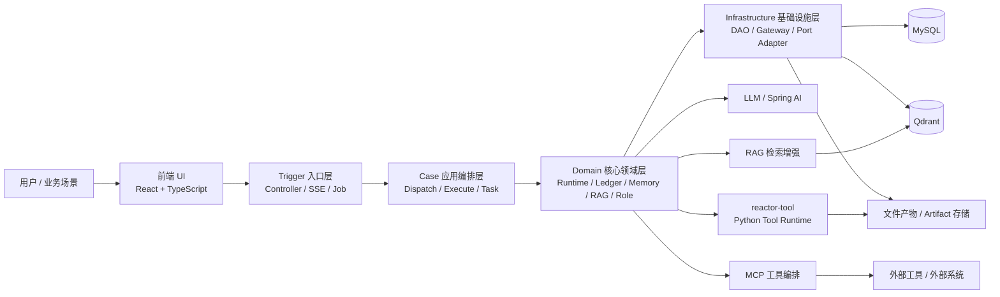
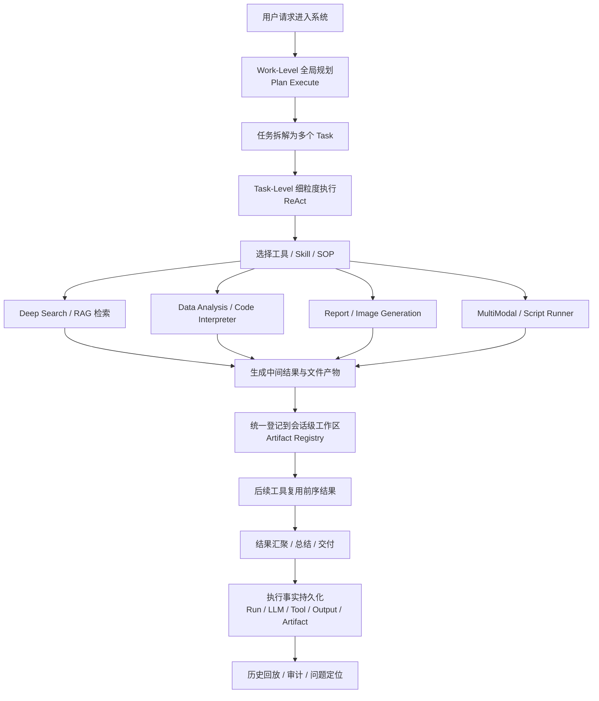

# Reactor 多智能体协同应用平台

## 项目简介

`Reactor-agent` 是一个面向业务提效与 AI 应用落地的 **Reactor 多智能体协同应用平台**。  
平台围绕复杂任务自动化场景，提供多策略 Agent 调度、MCP 工具编排、RAG 检索增强、会话记忆、执行过程持久化与历史回放能力，能够按业务场景动态组织多智能体分工协作，完成复杂任务拆解、工具调用、结果汇聚与执行链路追踪，提升运维、分析、知识处理等场景下的自动化与智能化水平。

## 技术栈

- 后端：Java 17、Spring Boot 3、Spring AI、MyBatis / MyBatis-Plus、OkHttp SSE
- 数据层：MySQL、Qdrant
- 智能检索：RAG、混合召回、Rerank、多轮检索
- 前端：React 19、TypeScript、Vite、Ant Design
- Python 工具侧：FastAPI、Pydantic、MCP Tooling

## 系统架构图



上图描述了平台的主运行时边界：前端通过 Trigger 进入应用，Case 负责多智能体调度与任务编排，Domain 承担 Agent 运行时、记忆、RAG、执行账本等核心语义，Infrastructure 负责数据库、文件、远端工具与外部网关适配。

## 核心能力

### 1. 多智能体协同与混合思维执行

- 设计并实现 `Plan Execute + ReAct` 双模式混合思维架构：
  - `Work-Level` 负责全局规划与任务编排
  - `Task-Level` 负责细粒度执行与工具调用
- 支持将复杂任务拆解为多个可并发子任务，提升复杂场景下的可拆解性、执行效率与协同能力
- 支持多策略 Agent 动态调度，按业务场景组织不同角色、不同能力的智能体协作完成目标

### 2. 共享工作区与工具组合执行

- 搭建工具产物登记与可见性机制，将搜索结果、分析文件、报告、图片、多模态检索结果统一沉淀到会话级工作区
- 支持跨工具传递、上下文续用与任务级结果串联，形成 `搜索 -> 分析 -> 报告 -> 汇总` 的多工具组合闭环
- 让前序工具生成的文件与中间结果可以被后续工具直接复用，避免链路割裂和重复处理

### 3. Skill + SOP 标准作业体系

- 构建 Agent 的 `Skill + SOP` 任务编排机制，将专家能力与执行流程模块化沉淀为可复用能力
- 通过显式流程约束和标准作业步骤，增强复杂任务的执行确定性
- 降低模型自由发挥导致的任务跑偏、步骤遗漏和结果不一致问题，提升多步骤任务的完成度与交付一致性

### 4. RAG 与混合检索增强

- 基于 Qdrant 搭建 **语义向量召回 + BM25 关键词召回 + 文本到图片/页面的跨模态混合检索体系**
- 结合查询重写、子问题扩展、多轮检索与重排序机制，提升图文混合知识场景下的检索相关性
- 支持复杂知识任务中的证据补全、上下文增强与多源内容融合

### 5. 执行事实持久化与历史回放

- 统一记录对话过程产生的执行事实，覆盖对话运行、LLM 调用、工具调用、工具输出、文件产物等关键节点
- 支持复杂任务链路的审计、问题定位与历史回放，提升 Agent 系统的可观测性与可维护性
- 通过结构化工具输出与 artifact 引用，支持前端按历史记录稳定恢复结果展示

### 6. 跨语言工具运行时

- 采用 `Java 编排 + Python 工具执行` 的跨语言协同模式
- Java 主链路负责 Agent 编排、执行上下文与账本记录
- Python 工具侧负责脚本执行、文件处理、多模态能力与部分智能工具落地
- 统一封装流式调用、超时控制、失败处理与文件回传，降低新工具接入成本

## 执行链路图



这条链路体现了平台的核心设计思想：复杂任务先做全局规划，再进入任务级 ReAct 执行；工具执行过程中产生的中间结果不会丢失，而是统一沉淀到会话级工作区，供后续工具继续复用，最终形成可回放、可审计的完整执行闭环。

## 典型应用场景

- 运维排障与流程自动化
- 数据分析与报告生成
- 知识检索与图文混合问答
- 多步骤任务编排与结果汇总
- 复杂业务流程中的智能辅助执行

## 项目结构

```text
Reactor-agent/
├── Reactor-agent-types/           # 基础类型、常量、任务调度接口
├── Reactor-agent-api/             # DTO 与服务接口契约
├── Reactor-agent-case/            # 应用编排层：调度、执行、任务与能力组织
├── Reactor-agent-domain/          # 领域核心：runtime / ledger / memory / rag / role
├── Reactor-agent-infrastructure/  # DAO、仓储实现、外部网关、持久化适配
├── Reactor-agent-trigger/         # Controller、SSE、Job 等入口适配层
├── Reactor-agent-app/             # Spring Boot 启动、配置、Mapper XML
├── reactor-tool/                           # Python 工具集、脚本执行与工具服务
├── ui/                                     # React 前端
├── runtime/skills/                         # 运行时 Skill 目录
└── docs/                                   # 设计与补充文档
```

## 架构说明

项目整体遵循 DDD 分层设计，并在 Agent 主链路中逐步收敛为以下职责边界：

- `trigger`：负责 HTTP / SSE / Job 等外部入口协议适配
- `case`：负责多智能体编排、任务调度、执行组织与能力协调
- `domain`：负责 Agent runtime、执行账本、记忆、RAG、角色能力等核心领域语义
- `infrastructure`：负责 DAO、外部服务、文件、远端工具、检索与持久化适配
- `app`：负责 Spring Boot 装配、配置绑定与运行时启动

这种分层方式使平台既能承载复杂 Agent 场景，又能保持较好的演进能力和维护性。

## 快速启动

### 1. 启动后端

```bash
mvn -pl Reactor-agent-app spring-boot:run
```

### 2. 启动前端

```bash
cd ui
npm install
npm run dev
```

### 3. 启动 Python 工具服务

```bash
cd reactor-tool
uv run python server.py
```

## 常用命令

### 后端

```bash
# 启动应用
mvn -pl Reactor-agent-app spring-boot:run

# 运行应用测试
mvn test -pl Reactor-agent-app -DskipTests=false

# 运行领域层回归测试
mvn test -pl Reactor-agent-domain -am -DskipTests=false
```

### 前端

```bash
cd ui
npm install
npm run dev
npm run build
npm run lint
```

### Python 工具侧

```bash
cd reactor-tool
uv run python server.py
```

## 亮点总结

- 支持 `Plan Execute + ReAct` 双模式混合思维架构
- 支持多智能体协同与复杂任务拆解执行
- 支持会话级共享工作区与工具产物复用
- 支持 `Skill + SOP` 标准作业体系，增强任务执行稳定性
- 支持基于 Qdrant 的图文混合 RAG 检索增强
- 支持工具输出、执行事实与历史结果的结构化持久化与回放

## 后续演进方向

- 更细粒度的工具权限与运行时隔离
- 更智能的多 Agent 协作策略与角色编排
- 更完善的管理后台、配置中心与可观测性能力

## 说明

本项目聚焦于 **Reactor 多智能体协同应用平台** 的工程化落地，不仅关注模型调用本身，更关注复杂任务在真实业务系统中的规划、执行、工具协同、结果沉淀与运行可观测性。
